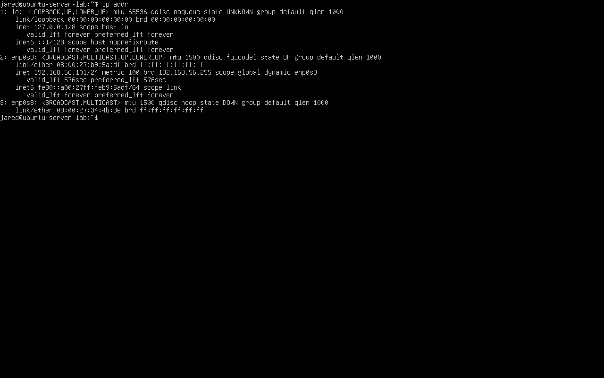
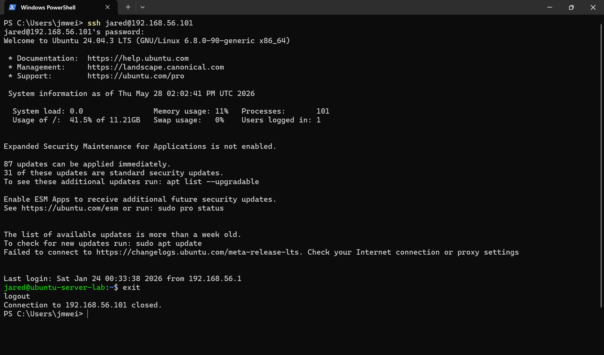

# Lab 01 – SSH Authentication Logging

## Objective

Observe how SSH authentication attempts are recorded on an Ubuntu Server VM and identify the log fields that distinguish normal access from suspicious authentication behavior.

This lab establishes the baseline telemetry used throughout the rest of the SSH detection engineering workflow.

Before building detection logic, automated blocking, or Python correlation rules, the first step is to understand what OpenSSH writes to the local authentication log.

---

## Detection Focus

This lab focuses on raw SSH authentication telemetry.

Primary log source:

~~~text
/var/log/auth.log
~~~

Primary SSH event types:

| Event Type | Meaning |
|---|---|
| `Accepted password` | Successful SSH authentication |
| `Failed password` | Failed SSH authentication attempt |
| `Invalid user` | Attempt against a non-existent local account |
| Source IP | System that initiated the SSH connection |
| Target username | Account name used during the login attempt |
| Timestamp | Time the authentication event occurred |

---

## Environment

| Component | Value |
|---|---|
| Server OS | Ubuntu Server 24.04.3 LTS |
| Service | OpenSSH Server (`sshd`) |
| Client / Source | Windows 11 host |
| Source IP | `192.168.56.1` |
| Target IP | `192.168.56.101` |
| Log Source | `/var/log/auth.log` |

Evidence:

---

## Procedure

The baseline logging test followed this process:

1. Confirmed the Ubuntu VM had a valid host-only IP address
2. Confirmed the OpenSSH service was active
3. Initiated SSH connections from the Windows host
4. Generated both failed and successful authentication attempts
5. Reviewed `/var/log/auth.log` to confirm authentication telemetry
6. Identified key fields needed for later detection logic

---

## Commands Used

### Confirm SSH Service Status

~~~bash
sudo systemctl status ssh
~~~

Purpose:

- Verify OpenSSH is installed
- Confirm the SSH daemon is running
- Confirm the VM can receive SSH authentication attempts

---

### Review Recent SSH Authentication Events

~~~bash
sudo grep "sshd" /var/log/auth.log | tail -30
~~~

Purpose:

- Show recent SSH-related authentication activity
- Filter out unrelated authentication events
- Confirm OpenSSH is writing to `/var/log/auth.log`

---

### Review Failed Password Events

~~~bash
sudo grep "sshd" /var/log/auth.log | grep "Failed password" | tail -20
~~~

Purpose:

- Identify failed SSH authentication attempts
- Observe failed login structure
- Capture usernames and source IP addresses used in failed attempts

Evidence:

---

### Review Invalid User Events

~~~bash
sudo grep "sshd" /var/log/auth.log | grep "Invalid user" | tail -20
~~~

Purpose:

- Identify attempts against non-existent accounts
- Detect username probing behavior
- Establish a signal used in later brute-force and credential probing detection

Evidence:

---

### Review Successful Login Events

~~~bash
sudo grep "sshd" /var/log/auth.log | grep "Accepted password" | tail -20
~~~

Purpose:

- Identify successful SSH authentication
- Establish a normal successful login baseline
- Support later correlation between failed attempts and successful access

Evidence:

---

## Example SSH Log Patterns

### Successful Authentication

Example pattern:

~~~text
Accepted password for jared from 192.168.56.1 port <port> ssh2
~~~

Meaning:

- The user `jared` authenticated successfully
- The source IP was `192.168.56.1`
- The login occurred over SSH protocol version 2

Detection value:

- Establishes legitimate access
- Provides a success event for later failed-to-successful correlation
- Helps distinguish baseline authentication from suspicious activity

---

### Failed Authentication

Example pattern:

~~~text
Failed password for invalid user admin from 192.168.56.1 port <port> ssh2
~~~

Meaning:

- The login attempt failed
- The attempted username was invalid
- The source IP was `192.168.56.1`

Detection value:

- Failed passwords indicate unsuccessful authentication attempts
- Repeated failed passwords may indicate brute force or password guessing
- Invalid users may indicate username enumeration or automated probing

---

### Invalid User Probe

Example pattern:

~~~text
Invalid user test from 192.168.56.1 port <port>
~~~

Meaning:

- The account `test` does not exist on the Ubuntu VM
- The source attempted authentication against a non-existent username

Detection value:

- Invalid user activity is often more suspicious than a normal mistyped password
- Multiple invalid usernames from the same IP may indicate scanning or credential probing
- This signal is useful for later detection logic

---

## Key Log Fields

| Field | Why It Matters |
|---|---|
| Timestamp | Allows event ordering and time-window detection |
| Process name `sshd` | Confirms the event came from OpenSSH |
| Authentication result | Shows whether the attempt succeeded or failed |
| Username | Shows the account being targeted |
| Source IP | Identifies the system initiating authentication |
| Port | Shows the client-side source port used in the SSH session |
| Protocol | Confirms SSH protocol version |

These fields are required for later detection engineering tasks such as aggregation, time-window rules, and failed-to-successful login correlation.

---

## Baseline Observations

The authentication logs confirmed that OpenSSH generated clear telemetry for:

- failed password attempts
- invalid username attempts
- successful password authentication
- source IP tracking
- target username tracking
- event timestamps

This confirmed that `/var/log/auth.log` provides enough detail to support detection logic without needing external tools.

---

## Detection Signals Established

This lab established the following base detection signals:

| Signal | Detection Use |
|---|---|
| `Failed password` | Identify failed authentication attempts |
| `Invalid user` | Detect username probing |
| `Accepted password` | Identify successful access |
| Repeated source IP | Identify concentrated attack activity |
| Timestamp sequence | Support time-window and event correlation detections |
| Same IP with failure then success | Support possible compromise detection |

These signals are reused throughout later labs.

---

## Analyst Interpretation

From an analyst perspective, a single failed login may be benign.

However, the risk increases when logs show:

- repeated failed attempts from the same source IP
- multiple invalid usernames
- burst-style failures in a short time window
- failed attempts followed by a successful login
- failures targeting privileged or common usernames such as `root`, `admin`, or `test`

This lab establishes the raw visibility needed to identify those patterns.

---

## Outcome

This lab confirmed that SSH authentication activity is written to `/var/log/auth.log` and contains enough structure to support detection engineering.

The baseline telemetry collected here supports later labs focused on:

- brute-force pattern identification
- Fail2Ban automated response
- SSH log triage
- failed login aggregation
- Python detection-as-code
- failed-to-successful login correlation

---

## Key Takeaway

Detection engineering starts with understanding the raw log source.

Before writing rules or scripts, an analyst needs to know what normal and suspicious authentication events look like in the original telemetry.
