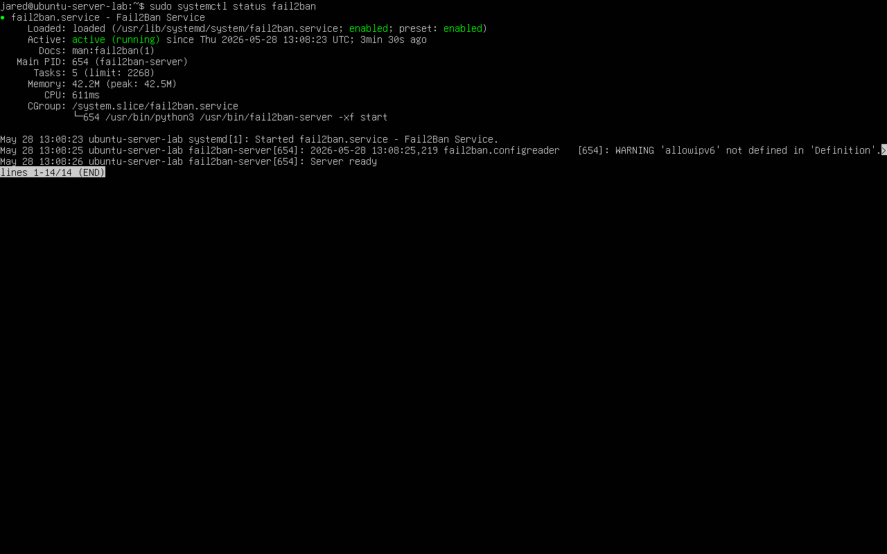
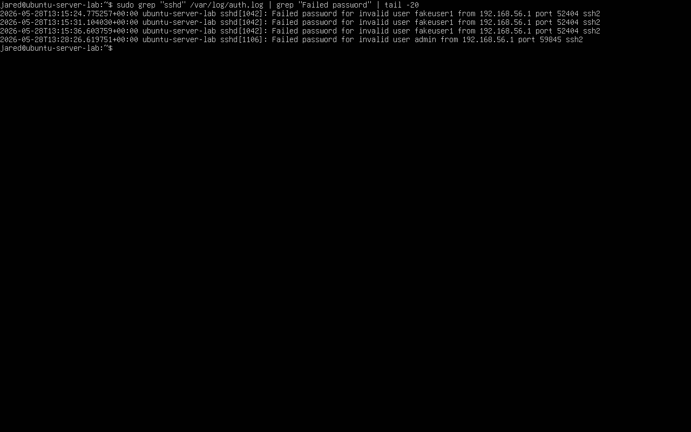
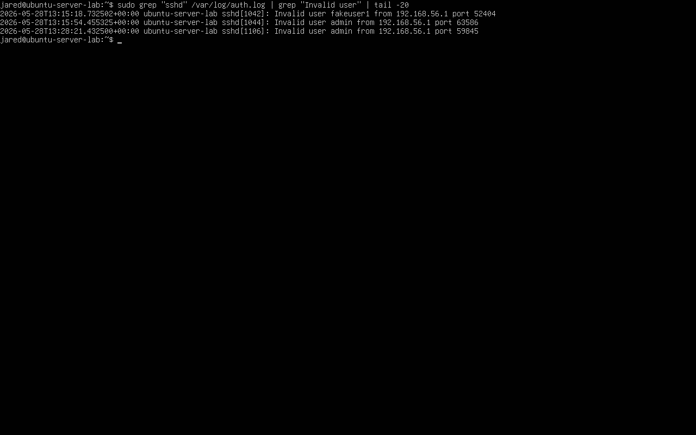
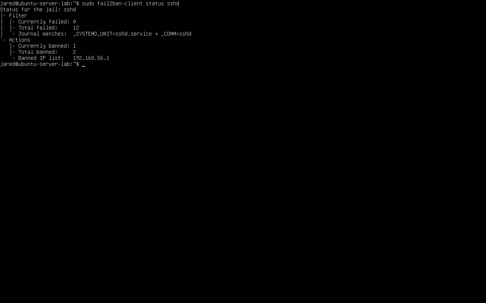

# Lab 03 – Fail2Ban Automated SSH Brute-Force Mitigation

## Objective

Detect repeated SSH authentication failures and automatically block the offending source IP using Fail2Ban.

This lab demonstrates how raw SSH authentication telemetry can trigger automated defensive response.

The goal is to move from:

~~~text
manual brute-force identification
        ↓
threshold-based detection
        ↓
automated IP blocking
        ↓
attacker-side validation
~~~

---

## Detection Focus

This lab focuses on automated mitigation of repeated SSH authentication failures.

Primary detection pattern:

~~~text
same source IP → multiple failed SSH login attempts → Fail2Ban ban
~~~

Primary response action:

~~~text
offending source IP is added to the sshd jail banned IP list
~~~

---

## Environment

| Component | Value |
|---|---|
| Server OS | Ubuntu Server 24.04.3 LTS |
| Service | OpenSSH Server (`sshd`) |
| Defense Tool | Fail2Ban |
| Jail | `sshd` |
| Log Source | `/var/log/auth.log` |
| Backend | `systemd` |
| Attack Source | Windows 11 host |
| Source IP | `192.168.56.1` |
| Target IP | `192.168.56.101` |

Evidence:

---

## Fail2Ban SSH Jail Configuration

The SSH jail was configured to monitor SSH authentication activity and ban source IPs that exceeded the configured failure threshold.

Core settings used in this lab:

| Setting | Value | Purpose |
|---|---|---|
| `enabled` | `true` | Enables the SSH jail |
| `filter` | `sshd` | Uses Fail2Ban's OpenSSH detection filter |
| `logpath` | `/var/log/auth.log` | Monitors Linux authentication logs |
| `backend` | `systemd` | Supports Ubuntu 24.04 logging behavior |
| `maxretry` | `5` | Bans after 5 failed attempts |
| `findtime` | `600` seconds | 10-minute detection window |
| `bantime` | `600` seconds | 10-minute ban duration |

The jail was validated with:

~~~bash
sudo fail2ban-client status sshd
~~~

Evidence before attack:

---

## Attack Simulation

Multiple failed SSH login attempts were generated from the Windows host using invalid usernames and incorrect passwords.

Example commands from Windows PowerShell:

~~~powershell
ssh fakeuser1@192.168.56.101
ssh admin@192.168.56.101
ssh test@192.168.56.101
ssh root@192.168.56.101
ssh fakeuser2@192.168.56.101
~~~

These attempts were designed to exceed the Fail2Ban `maxretry` threshold and trigger an automated ban.

Evidence:

---

## Raw Log Evidence

The failed SSH attempts were written to `/var/log/auth.log`.

Command used:

~~~bash
sudo grep "sshd" /var/log/auth.log | grep "Failed password" | tail -20
~~~

Evidence:

Invalid username activity was also confirmed with:

~~~bash
sudo grep "sshd" /var/log/auth.log | grep "Invalid user" | tail -20
~~~

Evidence:

---

## Detection Logic

Fail2Ban performs threshold-based log monitoring.

Detection flow:

~~~text
OpenSSH logs failed authentication event
        ↓
Event is written to /var/log/auth.log
        ↓
Fail2Ban sshd jail monitors authentication failures
        ↓
Source IP exceeds maxretry within findtime
        ↓
Fail2Ban triggers ban action
        ↓
Further SSH attempts from that IP are blocked
~~~

In this lab:

~~~text
5 failed attempts within 600 seconds → source IP ban for 600 seconds
~~~

---

## Automated Response

Once the threshold was exceeded, Fail2Ban automatically:

- identified the offending source IP
- added the source IP to the `sshd` jail banned list
- updated firewall enforcement
- blocked future SSH attempts from that source during the ban window

This converted SSH log telemetry into an active defensive control.

---

## Ban Validation

The SSH jail was inspected after the failed login attempts.

Command used:

~~~bash
sudo fail2ban-client status sshd
~~~

Expected indicators:

~~~text
Currently banned: 1
Banned IP list: 192.168.56.1
~~~

Evidence:

This confirmed that Fail2Ban detected the repeated failed authentication behavior and banned the source IP.

---

## Attacker-Side Blocking Validation

After Fail2Ban banned the source IP, another SSH attempt was made from Windows PowerShell.

Command used:

~~~powershell
ssh admin@192.168.56.101
~~~

The SSH connection timed out because the source IP was actively banned.

Evidence:

This is important because it validates enforcement from the attacker's perspective, not just from the defender's status output.

---

## Detection Rule

~~~text
Ban source IP when:
- SSH authentication failures exceed maxretry
- failures occur within the configured findtime window
- Fail2Ban sshd jail is enabled
~~~

Configured rule used in this lab:

~~~text
maxretry = 5
findtime = 600 seconds
bantime = 600 seconds
~~~

---

## Operational Commands

Check Fail2Ban service status:

~~~bash
sudo systemctl status fail2ban
~~~

List active jails:

~~~bash
sudo fail2ban-client status
~~~

Inspect SSH jail:

~~~bash
sudo fail2ban-client status sshd
~~~

Check jail values:

~~~bash
sudo fail2ban-client get sshd maxretry
sudo fail2ban-client get sshd findtime
sudo fail2ban-client get sshd bantime
~~~

Unban the lab source IP after testing:

~~~bash
sudo fail2ban-client set sshd unbanip 192.168.56.1
~~~

---

## Analyst Interpretation

Fail2Ban is not a replacement for full detection engineering, but it is useful for automated response against obvious repeated authentication failures.

From a SOC perspective, a Fail2Ban ban indicates:

- a source IP generated repeated failed SSH attempts
- the configured threshold was exceeded
- defensive automation took action
- the event should still be reviewed for context

An analyst would still want to investigate:

- which usernames were targeted
- whether the source IP is expected
- whether any successful login occurred before or after the failures
- whether similar activity appeared across other systems
- whether the ban threshold is tuned correctly

---

## False Positive Considerations

Fail2Ban may block legitimate users if they repeatedly mistype credentials.

Potential false positive scenarios:

- administrator mistypes password multiple times
- user has stale SSH credentials saved
- automation repeatedly attempts login with expired credentials
- shared IP or jump host generates multiple failures
- security testing triggers bans intentionally

In production, tuning decisions should consider:

- trusted admin IP ranges
- expected authentication behavior
- account lockout policies
- centralized logging visibility
- alerting and escalation requirements

---

## Limitations

This lab validates Fail2Ban in a controlled single-host environment.

Current limitations:

- single target host
- single source IP
- local-only network
- no centralized SIEM alerting
- no long-term ban analytics
- no distributed brute-force detection
- no account-level lockout policy
- no post-ban investigation automation

Fail2Ban handles obvious repeated failures, but more advanced detection logic is still needed for stealthier behavior such as low-and-slow attacks or failures followed by successful login.

---

## Outcome

This lab successfully validated automated SSH brute-force mitigation using Fail2Ban.

The lab confirmed:

- OpenSSH generated failed authentication telemetry
- Fail2Ban monitored the SSH authentication signal
- repeated failures from `192.168.56.1` triggered a ban
- the source IP appeared in the `sshd` jail banned list
- additional SSH attempts from the banned source timed out
- automated mitigation was validated from both defender and attacker perspectives

---

## Key Takeaway

Fail2Ban turns repeated SSH authentication failures into automated defensive action.

The most important validation is not only seeing the banned IP in Fail2Ban, but proving that the attacker can no longer connect after the ban is applied.
