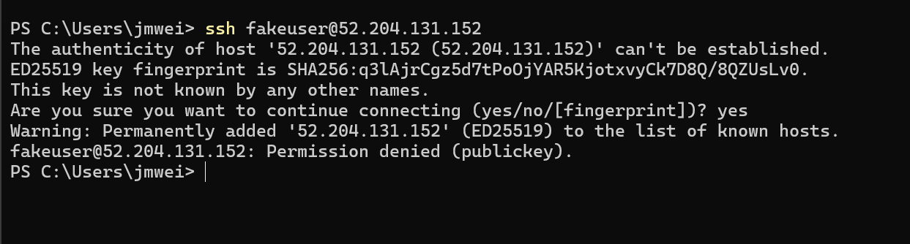
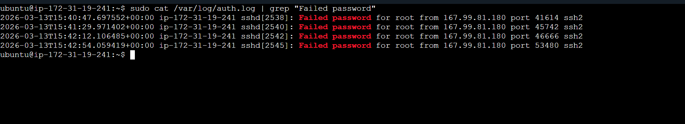
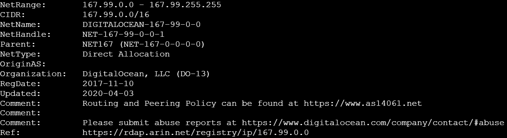
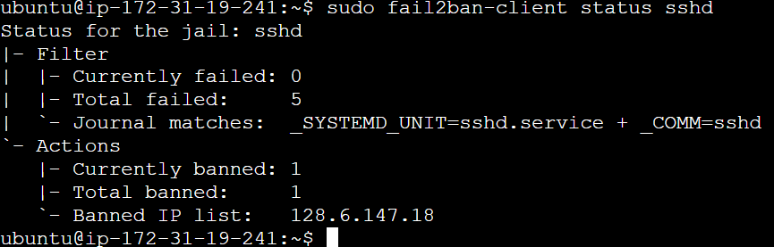

# 05 – Attack Simulation

## Purpose

This section documents the controlled attack simulations used to generate authentication telemetry for the SSH detection labs.

Rather than relying on static example logs, attacker behavior was intentionally simulated against the Ubuntu server to produce realistic authentication events.

These events were then analyzed and detected in the **Detection Engineering** section of the project.

---

## Lab Environment

Attack simulations were performed within the isolated lab environment.

**Target System**
- Ubuntu Server 24.04 LTS
- OpenSSH Server (`sshd`) running
- Authentication logs stored in `/var/log/auth.log`

**Attack Source**
- Windows 11 host system
- SSH client used to initiate connection attempts

**Network Setup**
- Host-only network between Windows host and Ubuntu VM
- Target server IP: `192.168.56.101`

This setup ensured attack activity remained fully contained within the lab environment.

---

## Attack Scenarios Simulated

The following attacker behaviors were simulated to generate authentication telemetry.

---

### Scenario 1 – Invalid Username Probing

Attackers frequently attempt SSH authentication using common usernames to discover valid accounts.

Example command:

```
ssh admin@192.168.56.101
```

Example log entry generated:

```
Failed password for invalid user admin from 192.168.56.1 port 53712 ssh2
```

Indicators produced:

- invalid username attempts
- failed authentication events
- attacker source IP visibility

These signals were used in **Lab 01 and Lab 02**.

---

### Scenario 2 – Repeated Authentication Failures

Multiple authentication attempts were generated to simulate brute-force login behavior.

Example command:

```
ssh testuser@192.168.56.101
```

Repeated attempts generated clusters of log entries such as:

```
Failed password for invalid user testuser from 192.168.56.1 port 53715 ssh2
```

Indicators produced:

- repeated failed login attempts
- high-frequency authentication failures
- single source IP generating multiple events

These signals were used in:

- **Lab 02 – Pattern Identification**
- **Lab 04 – Log Triage**
- **Lab 05 – Automated Log Analysis**

---

### Scenario 3 – Burst Authentication Attempts

To test time-based detection logic, authentication attempts were generated rapidly from the same source IP.

Observed pattern:

- multiple failed login attempts
- occurring within a short time window (≤60 seconds)

This activity generated burst-style authentication telemetry used to test the **time-window detection rule** implemented in Lab 06.

---

### Scenario 4 – Successful Login Event

A legitimate SSH login was performed to generate baseline authentication telemetry.

Example command:

```
ssh analyst@192.168.56.101
```

Example log entry:

```
Accepted password for analyst from 192.168.56.1 port 53801 ssh2
```

This event provided a reference point for distinguishing normal authentication behavior from attack patterns.

---

## Scenario 5 – SSH Brute Force Attack Simulation

To simulate a brute-force attack, repeated SSH login attempts were made against the exposed EC2 instance using invalid credentials.

### Attack Execution

    ssh fakeuser@52.204.131.152

### Result

The connection to the server was successfully established, but authentication failed:

- `Permission denied (publickey)` indicates that the server is configured to only allow key-based authentication  
- No valid private key was provided for the attempted user  
- The login attempt was rejected without granting shell access  

### Evidence

#### Step 1 – Initial Failed Login Attempt

The screenshot below shows a failed SSH authentication attempt from the attacker machine:



---

#### Step 2 – Fail2Ban Detection

Fail2Ban monitored authentication logs and detected repeated failed login attempts from the same source IP.

This confirms that the system identified behavior consistent with a brute-force attack.


---

#### Step 3 – IP Banned

After repeated failed login attempts were detected, Fail2Ban automatically banned the attacking IP address.

This demonstrates an active defensive response, not just passive detection.


---

#### Step 4 – Fail2Ban Status Verification

The Fail2Ban service was checked to confirm that protection mechanisms were active and enforcing bans.

This validates that the system is operational and responding to threats in real time.


#### Step 5 – Authentication Log Evidence

System authentication logs show repeated failed login attempts originating from the same attacker IP.

These logs provide the raw telemetry used for detection and automated response.



---

#### Step 6 – Attacker IP Analysis

The attacking IP address was analyzed to identify patterns and confirm malicious behavior.

This step mirrors real-world SOC workflows where analysts investigate suspicious sources.


---

#### Step 7 – WHOIS Analysis

A WHOIS lookup was performed on the attacker IP to gather additional intelligence about its origin.

This helps determine whether the activity is likely from a known hosting provider, botnet infrastructure, or malicious network.



---

#### Step 8 – Jail Status Confirmation

Fail2Ban jail status was reviewed to confirm that the attacker IP remains actively banned.

This ensures that mitigation is persistent and functioning as expected.



## Telemetry Generated

All authentication activity generated during attack simulation was recorded in:

```
/var/log/auth.log

```

These logs served as the primary data source for:

- authentication analysis
- brute-force detection
- automated log parsing
- time-window detection logic

---

## Relationship to Detection Labs

The attack simulations in this section produced the telemetry analyzed throughout the detection labs:

| Attack Behavior | Detection Lab |
|----------------|---------------|
| Authentication log observation | Lab 01 |
| Repeated login failures | Lab 02 |
| Automated brute-force blocking | Lab 03 |
| Log investigation and triage | Lab 04 |
| Script-based log aggregation | Lab 05 |
| Time-window brute-force detection | Lab 06 |

This demonstrates the full lifecycle of:

```
Attack Simulation
↓
Log Generation
↓
Detection Development
↓
Automated Response
```

---

## Why Attack Simulation Matters

Security detection logic must be tested against realistic attacker behavior.

By generating authentication events directly within the lab environment, these experiments ensured that detection logic was validated using **real system telemetry rather than static examples**.

This approach mirrors how detection engineering is tested and refined in production SOC environments.

---

## Future Enhancements

Future attack simulations could include:

- dictionary-based SSH brute-force attempts
- distributed authentication attempts from multiple IPs
- credential stuffing simulations
- automated attack generation using scripting tools
- integration with penetration testing frameworks
