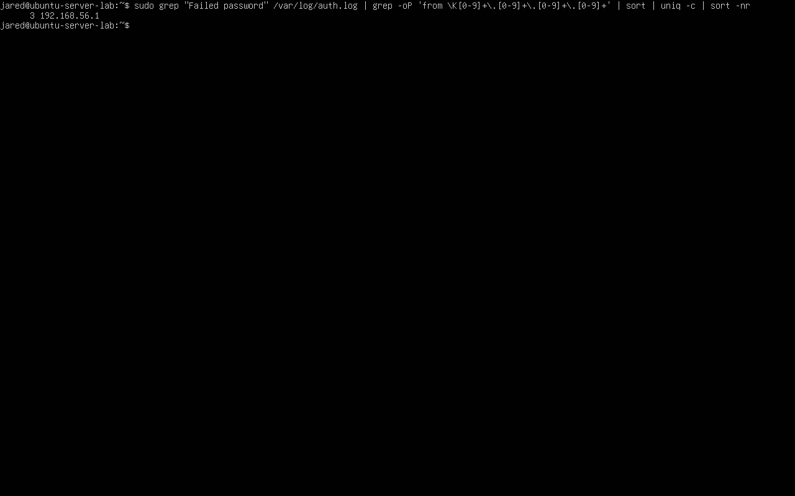
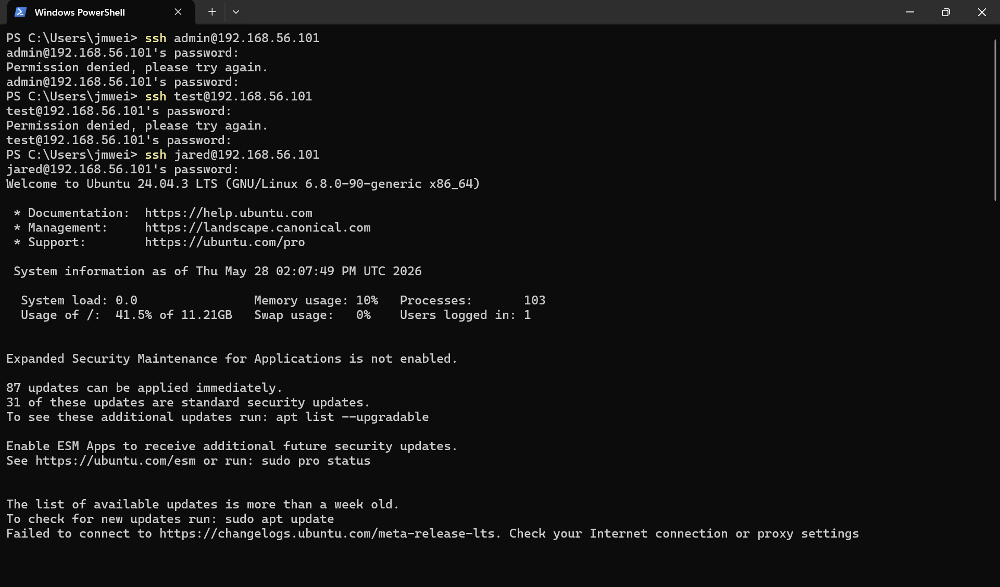
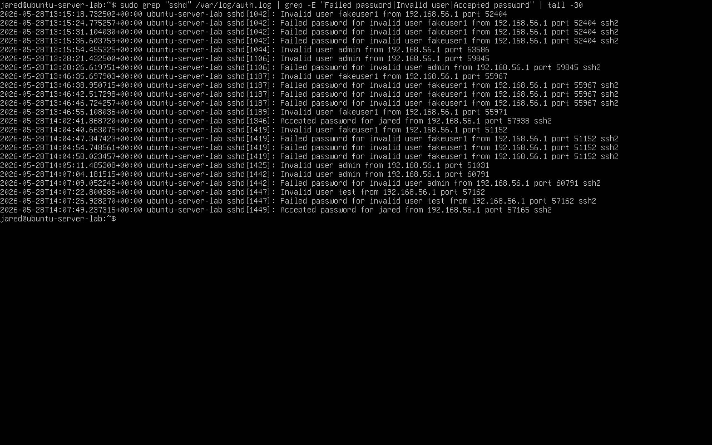
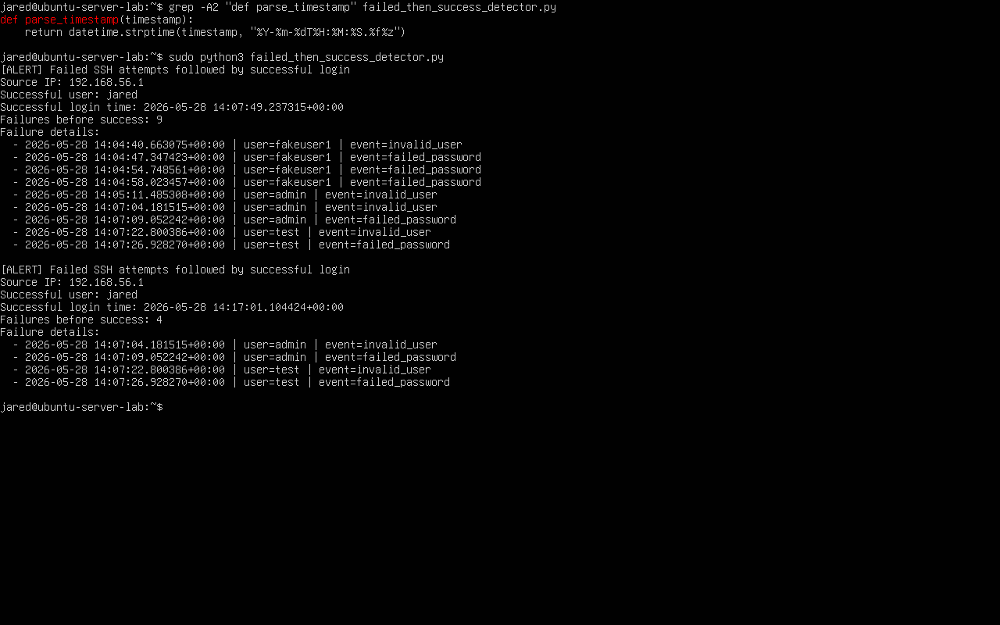
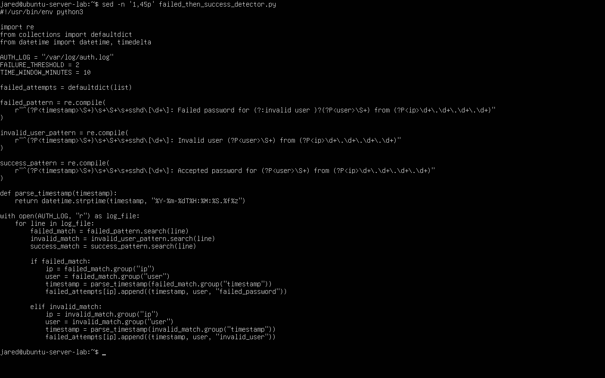
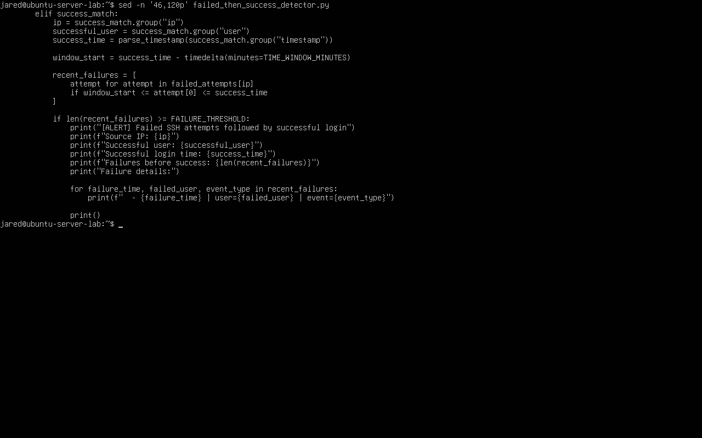

# SSH Brute Force Detection & Response Lab

## Overview

This lab is a host-based detection engineering project focused on SSH authentication attacks against a Linux server.

The lab uses a local VirtualBox environment to simulate SSH brute-force activity, generate real Linux authentication logs, validate automated blocking with Fail2Ban, and build custom detection logic for suspicious authentication patterns.

The project demonstrates the full workflow:

~~~text
Attack Simulation
        ↓
Linux Authentication Telemetry
        ↓
Manual Log Analysis
        ↓
Pattern Identification
        ↓
Automated Mitigation
        ↓
Detection-as-Code
        ↓
Failed-to-Successful Login Correlation
~~~

This was built as a local lab, not a public internet-facing deployment.

---

## What This Lab Proves

This lab proves the ability to:

- Build an isolated Linux SSH detection lab
- Generate real SSH authentication telemetry
- Analyze `/var/log/auth.log` for failed, invalid, and successful login events
- Identify brute-force-style authentication behavior
- Aggregate failed logins by source IP
- Configure and validate Fail2Ban automated blocking
- Confirm defensive enforcement from the attacker side
- Build detection logic using shell commands and Python
- Detect failed SSH attempts followed by successful login
- Document evidence, limitations, and analyst interpretation

The strongest part of the lab is that detections are backed by real screenshots, real logs, and controlled attack simulation rather than static example text.

---

## Environment

| Component | Value |
|---|---|
| Host System | Windows 11 |
| Virtualization | Oracle VirtualBox |
| Target System | Ubuntu Server 24.04.3 LTS |
| Target Hostname | `ubuntu-server-lab` |
| Target IP | `192.168.56.101` |
| Source IP | `192.168.56.1` |
| Target Service | OpenSSH Server |
| Log Source | `/var/log/auth.log` |
| Defensive Tool | Fail2Ban |
| Detection Logic | Shell commands and Python scripts |
| Network Type | Host-only VirtualBox network |

---

## Architecture Summary

~~~text
Windows 11 Host
(Admin + Attack Simulation Source)
        |
        | SSH attempts
        v
Ubuntu Server 24.04 VM
(OpenSSH Server)
        |
        | writes authentication events
        v
/var/log/auth.log
        |
        | analyzed by
        v
Manual Triage + Shell Aggregation + Python Detection
        |
        | defended by
        v
Fail2Ban sshd Jail
        |
        v
Automated IP Ban / Alert Output
~~~

Evidence:

---

## Repository Structure

~~~text
labs/01-ssh-bruteforce-detection/
│
├── 01-architecture/
│   └── Lab design, network boundaries, telemetry flow, and threat model
│
├── 02-setup-and-build/
│   └── Ubuntu VM setup, OpenSSH installation, Fail2Ban configuration, and validation
│
├── 03-operations-and-commands/
│   └── Operational commands used for SSH monitoring, triage, and response validation
│
├── 04-detection/
│   ├── lab-01-ssh-authentication-logging.md
│   ├── lab-02-ssh-bruteforce-pattern-identification.md
│   ├── lab-03-fail2ban-automated-ssh-bruteforce-mitigation.md
│   ├── lab-04-ssh-authentication-log-triage.md
│   ├── lab-05-automated-ssh-failed-login-analysis.md
│   ├── lab-06-ssh-bruteforce-time-window-detection.md
│   └── lab-07-failed-ssh-attempts-followed-by-successful-login.md
│
├── 05-attacks-and-simulation/
│   └── Controlled attack simulations used to generate SSH telemetry
│
├── 06-reflections-and-improvements/
│   └── Lessons learned, limitations, improvements, and interview talking points
│
└── screenshots/
    └── Evidence screenshots for the full lab
~~~

---

## Detection Coverage

| Detection / Control | Signal | Method | Output |
|---|---|---|---|
| SSH authentication logging | `Accepted password`, `Failed password`, `Invalid user` | Manual review of `/var/log/auth.log` | Baseline telemetry |
| Brute-force pattern identification | Repeated failed logins | Source IP aggregation | Suspicious source IP |
| Fail2Ban mitigation | Failure threshold exceeded | Fail2Ban `sshd` jail | Source IP ban |
| SSH log triage | Failed, invalid, and accepted events | SOC-style investigation workflow | Analyst assessment |
| Automated failed login analysis | Failed password events | Shell pipeline | Ranked failed-login source IPs |
| Time-window brute-force detection | Multiple failures in short window | Python detection-as-code | Alert output |
| Failed attempts followed by success | Prior failures followed by accepted login | Python correlation | Possible compromise-style alert |

---

## Key Results

- Generated controlled SSH failed login attempts from a Windows host
- Confirmed failed password events in `/var/log/auth.log`
- Confirmed invalid username probing in `/var/log/auth.log`
- Aggregated failed login attempts by source IP
- Triggered Fail2Ban against repeated failed SSH attempts
- Confirmed the source IP appeared in the Fail2Ban banned list
- Validated attacker-side blocking after the ban
- Generated a successful SSH login baseline
- Simulated failed SSH attempts followed by successful login
- Built a Python detector for failed-to-successful authentication correlation
- Captured screenshot evidence for each major detection and response step

---

## Attack Simulation Summary

The lab generated controlled SSH activity from Windows PowerShell.

Example failed login attempts:

~~~powershell
ssh fakeuser1@192.168.56.101
ssh admin@192.168.56.101
ssh test@192.168.56.101
ssh root@192.168.56.101
ssh fakeuser2@192.168.56.101
~~~

Evidence:

Server-side failed password evidence:

Invalid username evidence:

---

## Automated Mitigation Evidence

Fail2Ban was configured to monitor SSH authentication failures and ban source IPs that exceeded the configured threshold.

Configured values:

| Setting | Value |
|---|---|
| `maxretry` | `5` |
| `findtime` | `600` seconds |
| `bantime` | `600` seconds |

Evidence before attack:

Evidence after ban:

Attacker-side block validation:

---

## Failed Login Aggregation

Failed SSH attempts were aggregated by source IP using a shell pipeline.

Command used:

~~~bash
sudo grep "Failed password" /var/log/auth.log | grep -oP 'from \K[0-9]+\.[0-9]+\.[0-9]+\.[0-9]+' | sort | uniq -c | sort -nr
~~~

Evidence:

This was intentionally written to extract the IP after the `from` keyword rather than relying on fragile field positions.

---

## Advanced Detection: Failed Attempts Followed by Successful Login

The strongest detection in this lab identifies when failed or invalid SSH attempts are followed by a successful login from the same source IP.

Detection pattern:

~~~text
failed SSH attempts
        ↓
same source IP
        ↓
successful SSH login
~~~

This is higher value than basic failed-login counting because the final event is successful access.

Attack sequence:

~~~powershell
ssh admin@192.168.56.101
ssh test@192.168.56.101
ssh jared@192.168.56.101
~~~

Attacker-side evidence:

Server-side log evidence:

Python detector alert:

Python detector code evidence:

---

## Detection Engineering Progression

This lab intentionally builds detection capability in layers.

| Stage | Purpose |
|---|---|
| Raw log review | Understand SSH authentication telemetry |
| Pattern identification | Identify repeated failed authentication attempts |
| Automated mitigation | Block repeated failures with Fail2Ban |
| Log triage | Interpret suspicious authentication behavior |
| Shell automation | Aggregate failed logins by source IP |
| Python detection-as-code | Add time-window and correlation logic |
| Failed-to-successful detection | Identify possible successful compromise behavior |

This progression is what makes the lab more credible than a simple tool installation project.

---

## Skills Demonstrated

This lab demonstrates practical blue-team and detection engineering skills:

- Linux server administration
- VirtualBox lab design
- OpenSSH configuration and validation
- Linux authentication log analysis
- `/var/log/auth.log` investigation
- SSH brute-force simulation
- Fail2Ban configuration and validation
- Source IP aggregation
- Shell pipeline analysis
- Python log parsing
- Regex-based event extraction
- Time-window detection
- Failed-to-successful login correlation
- SOC-style triage and analyst interpretation
- False-positive reasoning
- Evidence-backed technical documentation

---

## Why This Project Matters

SSH brute-force attacks are common against Linux systems.

Security teams need to detect:

- failed password attempts
- invalid username probing
- repeated failures from one source
- authentication bursts
- successful logins after suspicious failures

This lab demonstrates how those signals appear in real Linux logs and how they can be converted into detection logic.

The most important lesson is that detection engineering starts with telemetry, not tools.

---

## Limitations

This lab is intentionally scoped.

Current limitations:

- single source IP
- single Ubuntu target
- local VirtualBox-only network
- no centralized SIEM ingestion
- no multi-host correlation
- no distributed brute-force simulation
- no post-login command monitoring
- no IP reputation enrichment
- no alert routing
- no persistent alert database

These limitations are acceptable because the goal is to demonstrate host-based SSH detection engineering using real authentication telemetry.

---

## Future Improvements

Potential future improvements include:

- Translate detections into Splunk SPL
- Translate detections into Elastic/KQL
- Translate detections into Microsoft Sentinel KQL
- Add post-login command monitoring after suspicious successful SSH authentication
- Simulate low-and-slow brute-force attempts
- Simulate password spraying across multiple local accounts
- Add multiple attacker IPs for distributed brute-force simulation
- Write Python detector alerts to a local output file
- Add severity scoring based on username, source IP, and failure count
- Forward SSH authentication logs into a SIEM-style platform

---

## Interview Summary

This project can be summarized as:

~~~text
I built a local SSH detection engineering lab where I generated controlled authentication attacks, analyzed Linux auth logs, validated Fail2Ban automated blocking, and wrote custom detection logic to identify repeated failures and failed attempts followed by successful login.
~~~

Strong points to discuss:

- The lab used real SSH telemetry, not mock logs.
- Detection logic was built after validating raw log behavior.
- Fail2Ban response was validated from both defender and attacker perspectives.
- The project moved from manual triage to automation to detection-as-code.
- The advanced detection focuses on possible successful compromise, not only failed attempts.

---

## Author

Jared Weiss  
IT & Cybersecurity Student

GitHub:  
https://github.com/Jared284
