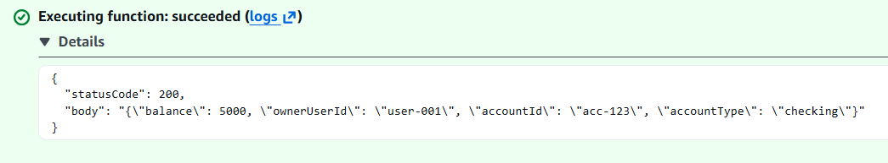
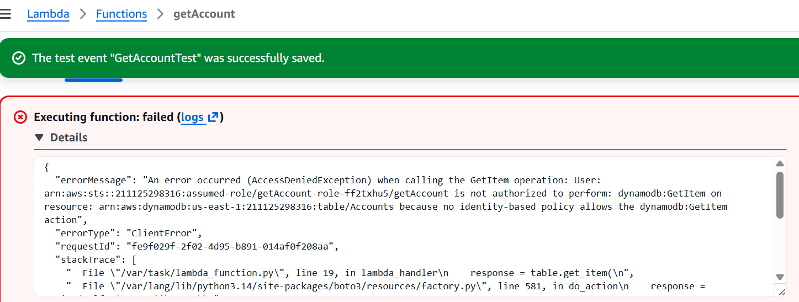

# Lambda Function: getAccount Vulnerable Implementation

## Overview

This file documents the vulnerable version of the `getAccount` Lambda function used in the AWS Banking API Security Lab.

The function was intentionally built without object-level authorization so the BOLA vulnerability could be tested and documented.

The vulnerable function performed a basic account lookup:

~~~text
Receive accountId
        ↓
Query DynamoDB
        ↓
Return account data
~~~

The missing security control was ownership validation.

---

## Purpose of the Function

The `getAccount` Lambda function acted as the backend for the account lookup API.

It was connected to this API Gateway route:

~~~http
GET /accounts/{accountId}
~~~

The function's job was to:

1. Receive the requested `accountId`
2. Query DynamoDB for the matching account
3. Return the account record to the requester

In the vulnerable version, the function did not verify whether the requester owned the requested account.

---

## Vulnerable Logic

The vulnerable implementation trusted the `accountId` supplied in the request path.

Vulnerable decision flow:

~~~text
Request contains accountId
        ↓
Lambda extracts accountId
        ↓
Lambda queries DynamoDB
        ↓
Account exists
        ↓
Return account data
~~~

This is insecure because the requester controls the `accountId`.

The function answered this question:

~~~text
Does the requested account exist?
~~~

But it failed to answer this question:

~~~text
Is the requester authorized to access this account?
~~~

That missing authorization check created the Broken Object Level Authorization vulnerability.

---

## Vulnerable Lambda Code Evidence

The screenshot below shows the vulnerable Lambda implementation that retrieves account data based on the supplied `accountId`.

---

## Vulnerable Code Behavior

The vulnerable Lambda function:

- Extracted `accountId` from the request
- Queried DynamoDB using the provided `accountId`
- Returned the account record if it existed
- Did not compare requester identity to account ownership
- Did not block unauthorized account access

Simplified vulnerable logic:

~~~text
accountId = request.pathParameters.accountId

account = DynamoDB.getItem(accountId)

if account exists:
    return account
else:
    return 404
~~~

The issue is that this logic treats knowledge of an account ID as permission to access the account.

---

## Why This Is Vulnerable

The vulnerability exists because account IDs are object identifiers, not authorization proof.

A requester can modify the URL path from one account to another:

~~~http
GET /accounts/acc-123
~~~

to:

~~~http
GET /accounts/acc-456
~~~

If the backend returns `acc-456` without checking ownership, then the API is vulnerable to BOLA.

---

## Expected Secure Behavior

The secure version should not return account data based only on the requested `accountId`.

Expected secure logic:

~~~text
accountId = request.pathParameters.accountId
requesterUserId = request.headers.x-user-id

account = DynamoDB.getItem(accountId)

if account.ownerUserId == requesterUserId:
    return account
else:
    return 403 Unauthorized
~~~

The vulnerable version did not perform this comparison.

---

## Test Case: Normal Account Access

The function was first tested with a normal account lookup.

Example request:

~~~text
Requested account: acc-123
~~~

Expected vulnerable result:

~~~text
Account data returned
~~~

This confirmed that the Lambda function could retrieve account records from DynamoDB.

Evidence:

---

## Test Case: Different Account Access

The function was then tested with a different account.

Example request:

~~~text
Requested account: acc-456
~~~

Expected vulnerable result:

~~~text
Account data returned
~~~

This confirmed that the function would return any valid account record as long as the requester supplied the account ID.

Evidence:

---

## IAM Permission Issue During Testing

During setup, the Lambda function initially failed because its execution role did not have permission to read from DynamoDB.

This was fixed by updating the Lambda execution role with the required DynamoDB read permissions.

Evidence:

Security note:

This permission issue was separate from the BOLA vulnerability.

IAM controls whether Lambda can access DynamoDB.  
Application authorization controls whether the requester should receive a specific account record.

After the IAM issue was fixed, Lambda could successfully query DynamoDB, which allowed the BOLA vulnerability to be tested.

---

## Evidence Summary

Evidence related to the vulnerable Lambda function includes:

| Screenshot | What It Shows |
|---|---|
| `lambda-code-get-account.png` | Vulnerable Lambda logic retrieving account data |
| `lambda-permission-error.png` | Initial DynamoDB permission issue |
| `lambda-test-acc-123.png` | Lambda returning account 123 |
| `lambda-test-acc-456.png` | Lambda returning account 456 |
| `bola-request-acc-123.png` | API returning legitimate account data |
| `bola-request-acc-456.png` | API returning another account's data |

---

## Security Impact

Because the Lambda function did not enforce ownership validation, any requester who knew or guessed another valid `accountId` could access that account's data.

Potential real-world impact in a banking or fintech system:

- Unauthorized account data exposure
- Customer privacy violation
- Financial data leakage
- Broken tenant/customer isolation
- Compliance risk
- Loss of trust in the application

The vulnerability is severe because the API can appear to work correctly while silently exposing data to unauthorized users.

---

## Root Cause

The root cause was missing object-level authorization.

The vulnerable function relied on this unsafe assumption:

~~~text
If the requester supplies a valid accountId, they can access the account.
~~~

The correct assumption should be:

~~~text
If the requester supplies a valid accountId, the backend must still verify ownership before returning data.
~~~

---

## Relationship to BOLA

This is a Broken Object Level Authorization vulnerability because the API exposes individual objects and does not verify whether the requester is allowed to access the requested object.

In this lab:

| BOLA Concept | Lab Example |
|---|---|
| Object | Bank account record |
| Object identifier | `accountId` |
| User-controlled input | `/accounts/{accountId}` |
| Missing control | Ownership validation |
| Impact | Unauthorized account access |

---

## Key Takeaway

The vulnerable Lambda function successfully retrieved account data, but it failed to enforce authorization.

That is the main lesson of this phase: functionality is not security.

A backend can return the correct database record and still be insecure if it does not verify whether the requester is allowed to access that record.
