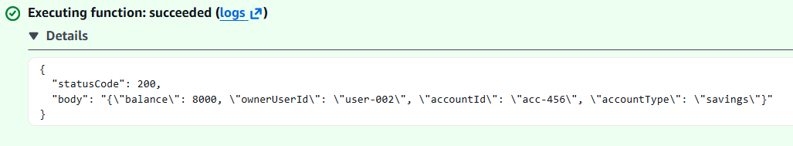

# Lambda Function: getAccount (Vulnerable Implementation)

## Overview

This Lambda function retrieves account data from DynamoDB based on the `accountId` provided in the API request.

The initial implementation does not perform any authorization checks and trusts user-supplied input directly.

---

## Behavior

- Extracts `accountId` from the request path
- Queries DynamoDB using the provided identifier
- Returns the account record without validating ownership

This creates a direct mapping:

User Input → Database Query → Response

---

## Security Issue

The function does not verify whether the requester is authorized to access the requested account.

As a result:
- Any valid `accountId` can be used
- Account ownership is ignored
- Data access is fully controlled by user input

This is a classic Broken Object Level Authorization (BOLA) vulnerability.

---

## Evidence

### Permission Error

Initial execution failed due to missing DynamoDB permissions.

---

### Lambda Code

The implementation retrieves account data based solely on the provided `accountId`.

---

### Test Result — Account 123

This confirms normal functionality when requesting an account directly.

---

### Test Result — Account 456

This demonstrates that the function also returns data for a different account when requested directly, with no authorization checks.

---

## Conclusion

The Lambda function allows unrestricted access to account data based on user-controlled input.

This lack of ownership validation enables unauthorized access and forms the foundation of the BOLA attack demonstrated in the next section.
