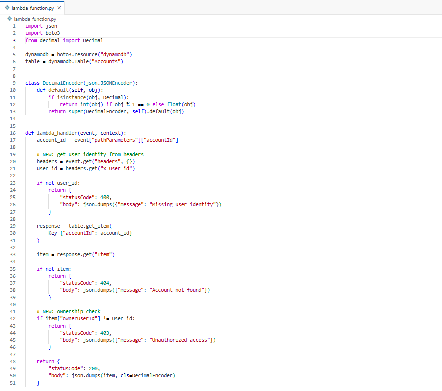
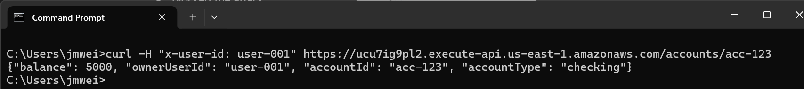
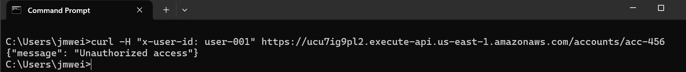

# Authorization Fix

## Overview

This file documents the remediation applied to fix the Broken Object Level Authorization (BOLA) vulnerability in the AWS Banking API Security Lab.

The original API returned account data based only on the `accountId` supplied in the request path. The fix added backend ownership validation so the API only returns account data when the requester owns the requested account.

The goal of this remediation was to change the API from:

~~~text
Object exists → return object
~~~

to:

~~~text
Object exists + requester owns object → return object
~~~

---

## Original Vulnerability

The vulnerable endpoint was:

~~~http
GET /accounts/{accountId}
~~~

The original Lambda function trusted the `accountId` path parameter.

Vulnerable flow:

~~~text
Requester supplies accountId
        ↓
Lambda queries DynamoDB
        ↓
DynamoDB returns account record
        ↓
Lambda returns account data
        ↓
No ownership validation
~~~

This allowed a requester to modify the object identifier and access another user's account.

Example:

~~~text
Requester: user-001
Legitimate account: acc-123
Modified target account: acc-456
~~~

In the vulnerable version, both requests returned account data.

---

## Root Cause

The root cause was missing object-level authorization.

The vulnerable function checked:

~~~text
Does this account exist?
~~~

But it did not check:

~~~text
Does this requester own this account?
~~~

That missing second check created the BOLA condition.

---

## Remediation Strategy

The fix was to enforce ownership validation in the backend Lambda function before returning data.

The updated function now checks three things:

1. What account is being requested?
2. Who is making the request?
3. Does the requester own the requested account?

The key authorization rule is:

~~~text
requesterUserId == account.ownerUserId
~~~

If the values match, access is allowed.

If the values do not match, access is denied.

---

## Updated Request Requirements

The secure version uses a simulated identity header:

~~~http
x-user-id: user-001
~~~

Example authorized request:

~~~http
GET /accounts/acc-123
x-user-id: user-001
~~~

Example unauthorized request:

~~~http
GET /accounts/acc-456
x-user-id: user-001
~~~

Important limitation:

~~~text
x-user-id is used only as a lab simplification.
~~~

In a production system, requester identity should come from a trusted identity provider such as Amazon Cognito, OIDC, SAML, or verified JWT claims.

---

## Secure Authorization Flow

The secure Lambda function follows this logic:

~~~text
Receive request
        ↓
Extract accountId from path
        ↓
Extract requester identity from x-user-id header
        ↓
Query DynamoDB for requested account
        ↓
Read account.ownerUserId
        ↓
Compare requesterUserId to ownerUserId
        ↓
Allow if match
Deny if mismatch
~~~

This ensures that knowledge of an account ID is not enough to access the account.

---

## Before-and-After Logic

### Vulnerable Logic

~~~text
accountId = request.pathParameters.accountId

account = DynamoDB.getItem(accountId)

if account exists:
    return account
else:
    return 404
~~~

Security issue:

~~~text
No requester identity is checked.
No ownership relationship is validated.
~~~

---

### Secure Logic

~~~text
accountId = request.pathParameters.accountId
requesterUserId = request.headers.x-user-id

account = DynamoDB.getItem(accountId)

if account does not exist:
    return 404

if account.ownerUserId != requesterUserId:
    return 403 Unauthorized

return account
~~~

Security improvement:

~~~text
The account is only returned when the requester owns it.
~~~

---

## Authorization Code Evidence

The screenshot below shows the Lambda authorization check added during remediation.

---

## Remediation Validation

The same access pattern was tested after the authorization check was added.

| Requester | Requested Account | Account Owner | Expected Result |
|---|---|---|---|
| `user-001` | `acc-123` | `user-001` | Allowed |
| `user-001` | `acc-456` | `user-002` | Denied |

This validation proves that the fix blocked unauthorized access without breaking legitimate access.

---

## Authorized Request Test

Test case:

~~~http
GET /accounts/acc-123
x-user-id: user-001
~~~

Expected result:

~~~text
200 OK
Account data returned
~~~

Why it should succeed:

~~~text
requesterUserId = user-001
ownerUserId = user-001
authorization result = allowed
~~~

Evidence:

---

## Unauthorized Request Test

Test case:

~~~http
GET /accounts/acc-456
x-user-id: user-001
~~~

Expected result:

~~~text
403 Unauthorized
Access denied
~~~

Why it should fail:

~~~text
requesterUserId = user-001
ownerUserId = user-002
authorization result = denied
~~~

Evidence:

---

## Security Impact

Before the fix, a requester could access another user's account by changing the URL path.

Before:

~~~text
/accounts/acc-456 → account data returned
~~~

After:

~~~text
/accounts/acc-456 + wrong requester identity → 403 Unauthorized
~~~

The fix prevents unauthorized object access by enforcing the account ownership boundary.

---

## Why This Fix Works

The fix works because authorization is enforced at the point where sensitive data is about to be returned.

DynamoDB may still return the account record to Lambda, but Lambda now decides whether the requester should receive that data.

That distinction matters:

| Layer | Role |
|---|---|
| DynamoDB | Stores and returns account records |
| Lambda | Enforces ownership before returning data |
| API Gateway | Routes requests to Lambda |

The application backend must enforce object-level authorization because it understands the relationship between requester identity and account ownership.

---

## Evidence Summary

Evidence collected for this remediation includes:

| Screenshot | What It Shows |
|---|---|
| `lambda-authorization-check.png` | Secure Lambda code with ownership validation |
| `authorized-request.png` | Valid requester accessing their own account |
| `blocked-request.png` | Unauthorized requester blocked from another account |
| `bola-request-acc-456.png` | Vulnerable behavior before remediation |
| `lambda-test-acc-456.png` | Backend could retrieve the object before authorization was enforced |

---

## Remaining Limitations

This fix addresses the object-level authorization flaw, but the lab still uses a simplified identity model.

Current limitations:

- `x-user-id` is simulated and client-controlled
- No Cognito or JWT authorizer is implemented
- No signed token validation is performed
- No transaction-level authorization is fully implemented
- No automated authorization tests are included
- No CloudWatch alerting for repeated denied access attempts is included

A production version should replace the simulated identity header with verified identity claims from a trusted authentication provider.

---

## Production Hardening Recommendations

To make this remediation more production-ready, future improvements should include:

- Use Amazon Cognito or another identity provider
- Validate JWT claims before processing requests
- Use API Gateway authorizers
- Add authorization checks to all account and transaction endpoints
- Log denied access attempts in structured JSON
- Create CloudWatch metric filters for repeated authorization failures
- Add AWS WAF rate limiting
- Add automated tests for allowed and denied access cases
- Send security-relevant logs to a SIEM

---

## Key Takeaway

The authorization fix changed the API from simple object retrieval to authorized object retrieval.

The vulnerable API trusted the requested `accountId`. The secure API verifies that the requester owns the requested account before returning data. That ownership check is what prevents Broken Object Level Authorization.
