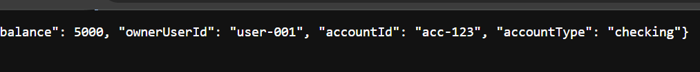
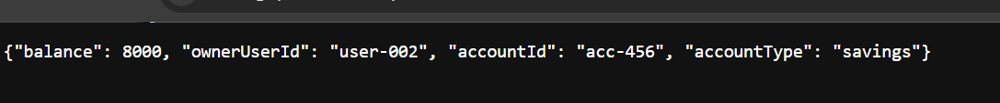

# BOLA Attack Simulation

## Overview

This file documents the Broken Object Level Authorization (BOLA) attack simulated against the AWS Banking API.

The goal of this phase was to prove that the vulnerable API allowed unauthorized access to another user's account data by changing the `accountId` value in the request path.

The vulnerable endpoint was:

~~~http
GET /accounts/{accountId}
~~~

The attack demonstrated that the backend trusted the requested object identifier without verifying account ownership.

---

## Vulnerability Summary

The vulnerable API returned account data based only on the `accountId` supplied by the requester.

In the vulnerable version, the API checked:

~~~text
Does this accountId exist?
~~~

But it did not check:

~~~text
Does this requester own this account?
~~~

That missing ownership validation created the BOLA vulnerability.

---

## Attack Target

The target endpoint was:

~~~http
GET /accounts/{accountId}
~~~

Example legitimate request:

~~~http
GET /accounts/acc-123
~~~

Example modified request:

~~~http
GET /accounts/acc-456
~~~

The `{accountId}` value is user-controlled, which means the requester can modify it.

---

## Test Data

The lab used two simulated users and two simulated accounts.

| User | Owned Account | Expected Access |
|---|---|---|
| `user-001` | `acc-123` | Should be allowed |
| `user-002` | `acc-456` | Should only be accessible by `user-002` |

The attack scenario tested whether `user-001` could access `acc-456`.

---

## Attack Preconditions

The BOLA attack required the following conditions:

- The API Gateway endpoint was reachable
- The Lambda function accepted `accountId` from the request path
- DynamoDB contained multiple account records
- The vulnerable Lambda function returned account data based only on `accountId`
- No ownership validation was enforced before returning data

These conditions created a direct object access failure.

---

## Vulnerable Request Flow

~~~text
Requester sends accountId
        ↓
API Gateway forwards request
        ↓
Lambda extracts accountId
        ↓
Lambda queries DynamoDB
        ↓
DynamoDB returns account record
        ↓
Lambda returns data
        ↓
No ownership check occurs
~~~

This flow allowed the requester to control which account object was returned.

---

## Attack Step 1: Request Legitimate Account

The first request targeted the account that should be accessible.

Request:

~~~http
GET /accounts/acc-123
~~~

Expected result:

~~~text
200 OK
Account data returned
~~~

Security meaning:

~~~text
Normal account lookup works.
~~~

Evidence:

---

## Attack Step 2: Modify Object Identifier

The next step was to modify the `accountId` in the request path.

Original request:

~~~http
GET /accounts/acc-123
~~~

Modified request:

~~~http
GET /accounts/acc-456
~~~

The only meaningful change was the object identifier.

This is the core BOLA test.

---

## Attack Step 3: Request Another User's Account

The modified request targeted another user's account.

Request:

~~~http
GET /accounts/acc-456
~~~

Expected secure behavior:

~~~text
403 Unauthorized
~~~

Actual vulnerable behavior:

~~~text
200 OK
Account data returned
~~~

Security meaning:

~~~text
The API returned another user's account data without verifying ownership.
~~~

Evidence:

---

## Attack Result

The attack succeeded.

The vulnerable API allowed unauthorized object access because it returned account data based only on the supplied `accountId`.

| Request | Expected Secure Result | Vulnerable Result |
|---|---|---|
| `GET /accounts/acc-123` | Allowed | Allowed |
| `GET /accounts/acc-456` | Denied | Allowed |

The second request proves the BOLA vulnerability.

---

## Why the Attack Worked

The attack worked because the backend trusted a user-controlled object identifier.

The vulnerable logic was:

~~~text
If accountId exists:
    return account data
~~~

This is insecure because knowledge of an account ID is not proof of authorization.

The secure logic should be:

~~~text
If accountId exists AND requester owns account:
    return account data
Else:
    deny access
~~~

The missing ownership check allowed the attack to succeed.

---

## Security Impact

In a real banking or fintech system, this vulnerability could expose sensitive customer information.

Potential impact includes:

- Unauthorized account data access
- Exposure of balances or transaction history
- Broken customer isolation
- Privacy violations
- Compliance risk
- Loss of trust in the application
- Possible financial fraud paths if write actions are also vulnerable

This type of vulnerability is severe because the API may appear to work correctly while exposing data to unauthorized users.

---

## Evidence Summary

Evidence collected during the attack phase includes:

| Screenshot | What It Shows |
|---|---|
| `bola-request-acc-123.png` | Request for the legitimate account |
| `bola-request-acc-456.png` | Modified request returning another account |
| `api-gateway-request.png` | API Gateway request testing |
| `lambda-test-acc-123.png` | Lambda retrieving account 123 |
| `lambda-test-acc-456.png` | Lambda retrieving account 456 |
| `transactions-records.png` | Backend records used for testing |

---

## What This Proves

This attack proves that the API had an object-level authorization failure.

The vulnerability was not caused by:

- Broken routing
- DynamoDB malfunction
- Lambda execution failure
- Missing account records

The vulnerability was caused by missing authorization logic.

The backend successfully retrieved account data, but it failed to verify whether the requester should receive that data.

---

## BOLA Concept Mapping

| BOLA Concept | Lab Example |
|---|---|
| Object | Bank account record |
| Object identifier | `accountId` |
| User-controlled input | `/accounts/{accountId}` |
| Unauthorized target | `acc-456` |
| Missing control | Ownership validation |
| Vulnerable result | Another user's account returned |
| Secure result | `403 Unauthorized` |

---

## Detection Opportunity

Although this lab focused mainly on exploitation and remediation, this attack pattern could also support detection engineering.

Useful events to monitor:

- Repeated requests for different `accountId` values
- Requests where requester identity does not match account owner
- Multiple denied authorization attempts
- Sequential account ID enumeration
- Unusual access patterns against sensitive account endpoints

Future detection improvements could include:

- Structured Lambda logs for authorization decisions
- CloudWatch metric filters for `authorization_denied`
- Alarms for repeated denied access attempts
- SIEM forwarding for object access anomalies

---

## Remediation Requirement

To fix this vulnerability, the backend needed to enforce ownership validation.

Required rule:

~~~text
requesterUserId == account.ownerUserId
~~~

If the requester does not own the account, the API should deny access.

Expected secure response:

~~~text
403 Unauthorized
~~~

The remediation is documented in:

- [Authorization Fix](../04-defense/authorization-fix.md)
- [Secure Lambda Implementation](../04-defense/lambda-get-account-secure.md)

---

## Key Takeaway

The attack succeeded because the API treated a user-controlled object identifier as authorization.

Changing `/accounts/acc-123` to `/accounts/acc-456` should not allow access to another user's account. The backend must verify ownership before returning sensitive data.

This is the core lesson of Broken Object Level Authorization.
