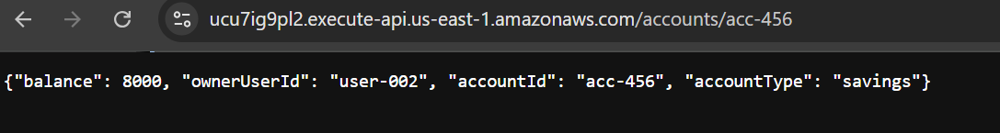

# Broken Object Level Authorization (BOLA) Attack

## Summary

This attack demonstrates a Broken Object Level Authorization (BOLA) vulnerability in the banking API.

The API returns account data based solely on the `accountId` supplied in the request path. It does not verify whether the requester is authorized to access the specified account.

As a result, an attacker can modify the object identifier in the URL and retrieve another user's account data.

## Vulnerable Endpoint

- Method: GET
- Path: /accounts/{accountId}

## Attack Preconditions

- The API endpoint is publicly reachable through API Gateway
- The backend Lambda function accepts any valid `accountId`
- No authentication or authorization checks are enforced
- Multiple account records exist in DynamoDB

## Attack Steps

1. Request account data for one valid account:
   - `/accounts/acc-123`

2. Observe that the API returns the corresponding account record

3. Modify the object identifier in the URL:
   - `/accounts/acc-456`

4. Observe that the API also returns the second account record

## Why the Attack Works

The backend trusts the user-supplied `accountId` and directly queries DynamoDB using that value.

It does not verify whether the requester owns the account being requested.

## Security Impact

This vulnerability allows unauthorized access to account-level data.

An attacker who can guess or enumerate valid account identifiers can retrieve records belonging to other users.

In a real banking environment, this could expose:
- account balances
- account ownership information
- transaction history
- other sensitive financial data

## Result

The attack was successful.

The API returned account data for a different account when the object identifier in the request path was changed.

## Evidence

### Request for Account 123

This request returns data for the first account using its direct object identifier.

---

### Modified Request for Account 456

This request changes only the object identifier in the path and returns a different user's account data.

