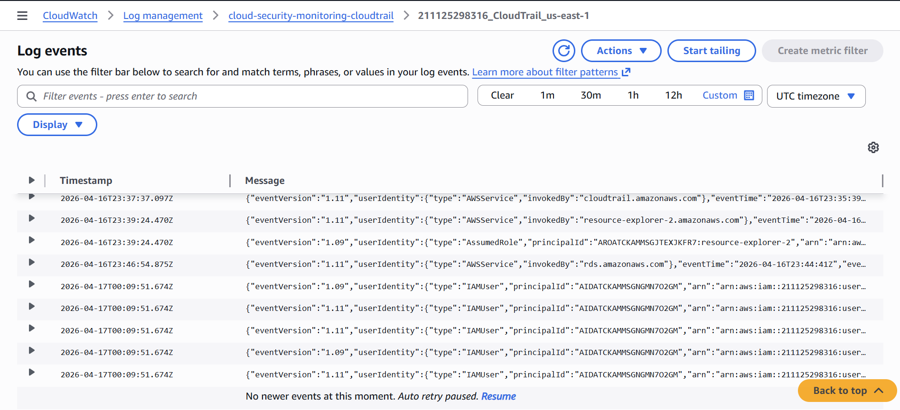

# 03 - Log Sources and Ingestion

## Objective

The goal of this phase was to establish the telemetry foundation for the lab by centralizing security-relevant logs from both:

- the EC2 monitoring host
- the AWS control plane

This mattered because the rest of the lab depends on reliable log collection before any detection engineering or alerting can happen.

## Telemetry Sources

This lab uses two main telemetry sources.

### 1. Host-Level Authentication Logs

The EC2 Ubuntu monitoring host generates Linux authentication telemetry in:

```text
/var/log/auth.log
```

These logs include SSH-related events such as:

- invalid-user login attempts
- failed authentication attempts
- accepted logins
- other SSH daemon authentication messages

For this lab, the most important host-side events were invalid-user SSH attempts.

### 2. AWS Control-Plane Activity

AWS administrative and API activity is collected through CloudTrail.

This telemetry includes events such as:

- API calls made against AWS services
- changes to security groups
- resource enumeration actions
- other management-plane operations

For this lab, the most important cloud-side event validated so far was:

```text
RevokeSecurityGroupIngress
```

## Ingestion Architecture

The lab uses two different ingestion paths depending on the telemetry source.

### Host-Side Ingestion Path

The EC2 instance uses the CloudWatch Agent to forward Linux authentication logs into CloudWatch Logs.

High-level flow:

1. the EC2 instance generates SSH authentication events in `/var/log/auth.log`
2. the CloudWatch Agent reads the log file
3. the agent forwards matching log data into CloudWatch Logs
4. the logs become available for centralized monitoring and later detection engineering

### CloudTrail-Side Ingestion Path

CloudTrail records AWS control-plane activity and delivers it into both S3 and CloudWatch Logs.

High-level flow:

1. an AWS administrative action occurs
2. CloudTrail records the event
3. CloudTrail delivers the event to S3 for storage
4. CloudTrail also delivers the event to CloudWatch Logs for monitoring and detection use

This allows the lab to use CloudWatch for both host-generated and AWS-generated telemetry.

## Log Groups Used

### Host Authentication Log Group

The Linux authentication log was forwarded into the CloudWatch log group:

```text
cloud-security-monitoring-auth
```

This log group was used later for the host-side SSH detection.

### CloudTrail Log Group

CloudTrail events were delivered into the CloudWatch log group:

```text
cloud-security-monitoring-cloudtrail
```

This log group was used later for the CloudTrail-side security group change detection.

## Supporting AWS Components

The following AWS components were used to support ingestion:

### EC2 Monitoring Host

- **Instance name:** `cloud-security-monitoring-host`
- **OS:** Ubuntu
- generated the host-side authentication telemetry used in the lab

### IAM Role for EC2 Log Forwarding

- **IAM role:** `cloud-security-monitoring-ec2-role`
- **Managed policy:** `CloudWatchAgentServerPolicy`

This role allowed the EC2 instance and CloudWatch Agent to publish logs into CloudWatch.

### CloudTrail Trail

- **Trail name:** `cloud-security-monitoring-trail`

This trail captured AWS control-plane activity and delivered it to both S3 and CloudWatch Logs.

### S3 Bucket

CloudTrail was configured to send logs to S3 for storage in addition to CloudWatch monitoring.

## Why These Sources Were Chosen

These two sources were chosen because together they provide visibility across two important layers:

- **inside the workload** through Linux host authentication logs
- **inside the AWS account** through CloudTrail administrative activity

That combination makes the lab stronger than a single-source logging project because it demonstrates monitoring across both:

- workload-level behavior
- cloud control-plane behavior

## Validation

I validated ingestion separately for both telemetry sources.

### 1. Host-Side Ingestion Validation

I confirmed that Linux authentication activity from `/var/log/auth.log` appeared in the CloudWatch log group:

```text
cloud-security-monitoring-auth
```

This proved that:

- the EC2 instance was generating the expected authentication telemetry
- the CloudWatch Agent was installed and working
- host logs were reaching CloudWatch successfully

### 2. CloudTrail-Side Ingestion Validation

I confirmed that AWS administrative activity appeared in the CloudWatch log group:

```text
cloud-security-monitoring-cloudtrail
```

I also confirmed specific CloudTrail events through Event history, including the security group ingress rule removal event used later in detection engineering.

This proved that:

- CloudTrail was recording AWS control-plane activity correctly
- CloudTrail delivery into CloudWatch Logs was working
- the cloud-side telemetry source was available for detection engineering

## How This Supports Later Phases

This phase created the ingestion layer required for the rest of the lab.

Without this phase, the later sections would not be possible:

- `04-attack-simulation` depends on host-side telemetry being generated
- `05-detection-engineering` depends on both log groups being populated
- `06-alerting-and-response` depends on those detections producing metrics and alarms

In other words, this phase established the raw data pipeline that the rest of the lab builds on.

## Limitations

At this stage, ingestion is functional but still simple.

Current limitations include:

- the host-side ingestion path currently focuses mainly on one Linux log source
- the cloud-side ingestion path has only been used for a limited set of CloudTrail detections so far
- logs are centralized, but not normalized into a broader SIEM platform
- correlation between telemetry sources is not yet implemented

Even with those limitations, this phase provides the core telemetry foundation needed for the rest of the project.

## Evidence

### Host Authentication Logs in CloudWatch


### CloudTrail Events in CloudWatch Logs



## Key Takeaway

This phase established the telemetry foundation for the lab by centralizing both Linux host authentication logs and AWS control-plane activity into CloudWatch Logs.

That groundwork made it possible to build detections and alerts on top of both:

- host-level authentication events
- cloud-level administrative events

This is what allowed the rest of the lab to evolve from simple log collection into a real cloud security monitoring workflow.
