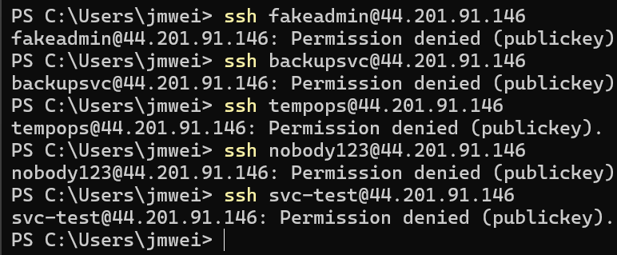
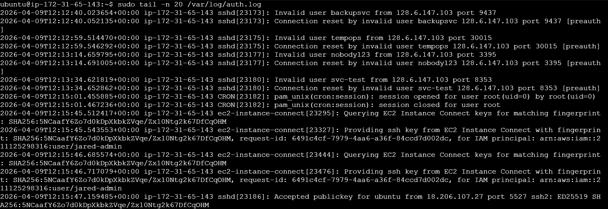
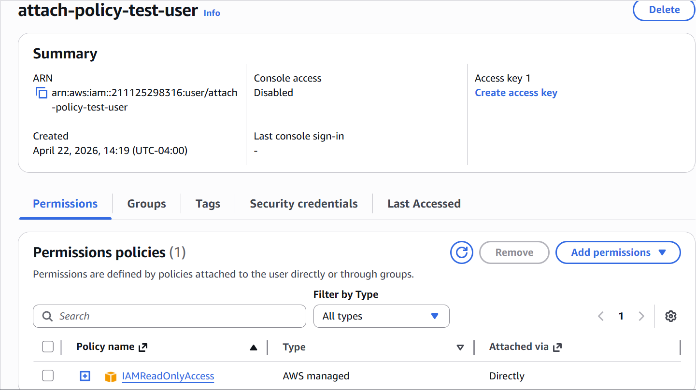
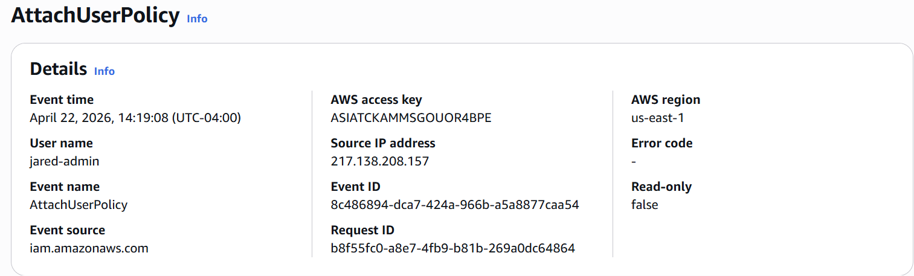

# 04 - Attack Simulation and Validation Activity

## Purpose

This section documents the controlled activity used to generate security-relevant telemetry for the AWS Cloud Security Monitoring Lab.

The goal of this phase was to produce real events that could later be detected, measured, alerted on, and validated.

This phase generated activity across two layers:

- **Host-level activity** against the EC2 monitoring host
- **AWS control-plane activity** captured by CloudTrail

These actions were controlled and intentionally scoped for lab validation. The purpose was not to cause damage, but to generate clear security signals for detection engineering.

---

## Validation Strategy

The lab used two categories of validation activity.

---

## Category 1: Host-Side Attack Simulation

The host-side test simulated an external actor attempting to access the EC2 instance over SSH using usernames that did not exist on the Linux host.

This generated invalid-user authentication events in:

```text
/var/log/auth.log
```

These events were then forwarded into CloudWatch Logs by the CloudWatch Agent and later used for host-based detection.

---

## Category 2: CloudTrail-Side Controlled Validation

The cloud-side tests used controlled AWS administrative actions to generate CloudTrail management events.

These actions were not destructive attacks. They were safe validation steps designed to produce specific AWS control-plane events for detection engineering.

The CloudTrail-side validation actions generated the following events:

```text
RevokeSecurityGroupIngress
AuthorizeSecurityGroupIngress
AttachUserPolicy
```

These events were later used to validate:

- CloudTrail event capture
- CloudWatch Logs ingestion
- CloudWatch metric filter matching
- Custom CloudWatch metric creation
- CloudWatch alarm triggering
- SNS email notification delivery

---

## Host-Side Attack Scenario

### Scenario Summary

I simulated repeated SSH login attempts against the EC2 monitoring host using fake usernames.

The goal was to generate `Invalid user` entries in the Linux authentication log.

### Target

| Field | Value |
|---|---|
| Target host | `cloud-security-monitoring-host` |
| Target type | AWS EC2 Ubuntu instance |
| Exposed service | SSH |
| Port | `22` |
| Host log source | `/var/log/auth.log` |

### Execution

From my local workstation, I generated repeated SSH login attempts using usernames that did not exist on the target system.

Example commands:

```bash
ssh fakeadmin@44.201.91.146
ssh backupsvc@44.201.91.146
ssh tempops@44.201.91.146
ssh nobody123@44.201.91.146
ssh svc-test@44.201.91.146
```

Each request reached the EC2 instance and was rejected by the SSH service.

The failed attempts produced `Invalid user` log entries on the host.

### Host-Side Log Validation

After generating the SSH attempts, I confirmed that the EC2 instance recorded the activity in:

```text
/var/log/auth.log
```

Example log pattern:

```text
Invalid user <username> from <source-ip>
```

Observed examples included:

```text
Invalid user backupsvc from 128.6.147.103
Invalid user tempops from 128.6.147.103
Invalid user nobody123 from 128.6.147.103
Invalid user svc-test from 128.6.147.103
```

This confirmed that the simulated SSH activity produced the exact host-level telemetry needed for the invalid-user SSH detection.

---

## CloudTrail-Side Validation Scenarios

The CloudTrail detections were validated by generating controlled AWS management events.

These actions were selected because they represent common security-relevant changes in cloud environments.

---

## Scenario 1: Security Group Ingress Rule Removal

### Action

I removed an ingress rule from the EC2 instance’s attached security group.

### CloudTrail Event Generated

```text
RevokeSecurityGroupIngress
```

### Why This Matters

Security group ingress rule changes affect network exposure.

A removed rule may be legitimate, but it is still a meaningful control-plane event because it changes how traffic can reach a cloud resource.

### Validation Purpose

This event was used to validate:

- CloudTrail event capture
- CloudWatch Logs ingestion
- Metric filter matching
- Custom metric creation
- CloudWatch alarm triggering
- SNS alert delivery

---

## Scenario 2: Security Group Ingress Rule Addition

### Action

I added an ingress rule to the EC2 instance’s attached security group.

### CloudTrail Event Generated

```text
AuthorizeSecurityGroupIngress
```

### Why This Matters

Security group ingress additions can increase the exposure of cloud resources.

For example, opening SSH or other sensitive services to a broader source range could create a major security risk.

### Validation Purpose

This event was used to validate:

- CloudTrail event capture
- CloudWatch Logs ingestion
- Metric filter matching
- Custom metric creation
- CloudWatch alarm triggering
- SNS alert delivery

---

## Scenario 3: IAM Managed Policy Attachment

### Action

I attached the AWS managed `IAMReadOnlyAccess` policy directly to a test IAM user.

### Test User

```text
attach-policy-test-user
```

### Policy Used

```text
IAMReadOnlyAccess
```

### CloudTrail Event Generated

```text
AttachUserPolicy
```

### Why This Matters

IAM policy attachments can expand the permissions available to an identity.

Unexpected policy attachment activity may indicate privilege expansion, misconfiguration, or unauthorized administrative behavior.

### Validation Purpose

This event was used to validate:

- CloudTrail event capture
- CloudWatch Logs ingestion
- Metric filter matching
- Custom metric creation
- CloudWatch alarm triggering
- SNS alert delivery

---

## Validation Activity Summary

| Validation Activity | Telemetry Source | Event / Pattern Generated | Detection Use |
|---|---|---|---|
| Repeated fake SSH usernames | `/var/log/auth.log` | `Invalid user` | Host-level SSH detection |
| Security group rule removal | CloudTrail | `RevokeSecurityGroupIngress` | Network-control-plane detection |
| Security group rule addition | CloudTrail | `AuthorizeSecurityGroupIngress` | Network-control-plane detection |
| IAM managed policy attachment | CloudTrail | `AttachUserPolicy` | Identity-control-plane detection |

---

## Why These Tests Were Chosen

These tests were chosen because they produce clear, repeatable security signals without requiring destructive activity or successful compromise.

### Host-Side Value

The SSH simulation represents workload-level authentication activity.

It shows how activity against a Linux host becomes security telemetry that can be forwarded, monitored, and detected.

### Cloud-Side Value

The security group tests represent network-control-plane changes that could affect exposure of cloud resources.

The IAM policy attachment test represents identity-control-plane activity that could indicate privilege expansion if performed unexpectedly.

Together, these tests created a clear signal path across multiple layers:

```text
Controlled activity
        ↓
Host or CloudTrail telemetry
        ↓
CloudWatch Logs
        ↓
Metric filters
        ↓
Custom metrics
        ↓
CloudWatch alarms
        ↓
SNS notifications
```

---

## Evidence

### Local SSH Attack Simulation



### Host Log Validation



### IAM Policy Attachment Validation



### CloudTrail AttachUserPolicy Event



---

## Scope and Safety

All validation activity was performed in a controlled AWS lab environment.

The testing was intentionally limited to:

- A lab EC2 instance
- A lab security group
- A test IAM user
- Non-destructive AWS actions
- Controlled SSH attempts against my own instance

No third-party systems were targeted.

The purpose of the activity was to generate security telemetry for monitoring and detection validation.

---

## Key Takeaway

This phase generated the controlled activity needed to validate the lab’s monitoring pipeline.

On the host side, repeated invalid-user SSH attempts produced Linux authentication events.

On the cloud side, controlled security group and IAM actions produced CloudTrail management events.

Together, these tests confirmed that the lab could generate meaningful telemetry across workload-level activity, network-control-plane changes, and identity-control-plane changes.
