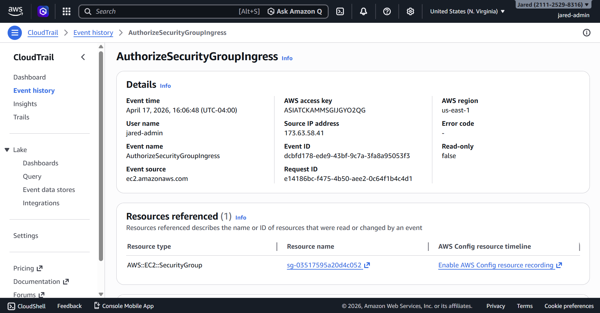
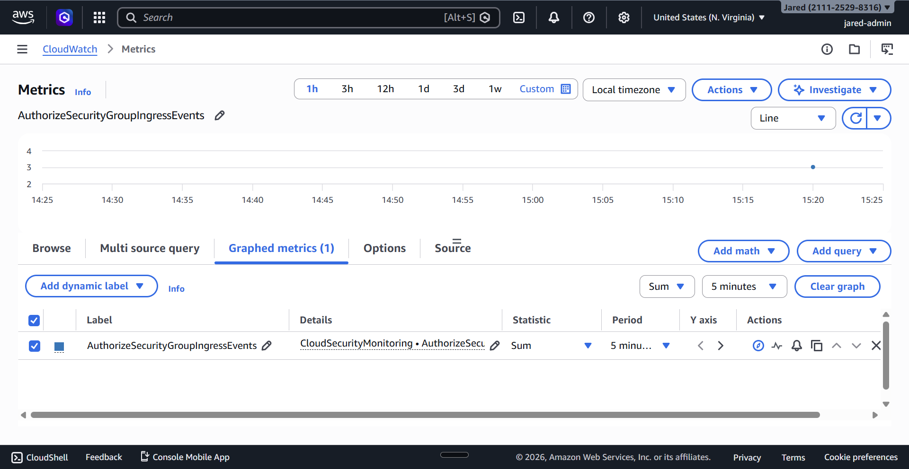
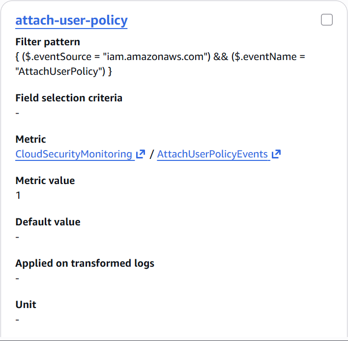
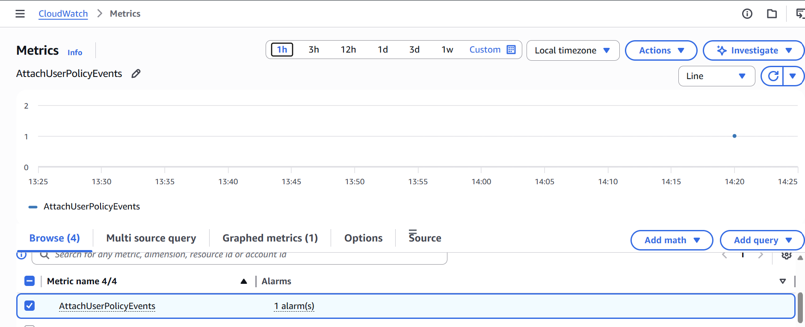

# 05 - Detection Engineering

## Objective

The goal of this phase was to convert raw security telemetry into measurable detection signals that could be monitored and later used for alerting.

For this part of the lab, I focused on four detection paths:

1. **Host-side detection** for repeated invalid-user SSH login attempts on the EC2 monitoring host
2. **CloudTrail-side detection** for AWS security group ingress rule removal events
3. **CloudTrail-side detection** for AWS security group ingress rule addition events
4. **CloudTrail-side detection** for IAM managed policy attachment events

Together, these detections demonstrate monitoring across host-level telemetry, network-control-plane telemetry, and identity-control-plane telemetry.

---

## Detection Scope

This phase includes four detection types:

- **Host-based detection:** repeated `Invalid user` SSH authentication activity
- **CloudTrail-based detection:** `RevokeSecurityGroupIngress` control-plane events
- **CloudTrail-based detection:** `AuthorizeSecurityGroupIngress` control-plane events
- **CloudTrail-based detection:** `AttachUserPolicy` control-plane events

This matters because the lab is designed to show visibility across multiple security layers:

- Linux host activity on the EC2 instance
- AWS administrative activity in the account itself
- network exposure changes through security group events
- IAM permission changes through identity events

---

## Host-Side Detection: Invalid SSH User Attempts

### Detection Goal

The host-side detection logic was designed to identify repeated `Invalid user` authentication events generated by the Linux SSH service.

This was a useful first detection because:

- it is easy to reproduce in a controlled way
- it maps to realistic reconnaissance and access-attempt behavior
- it creates a clear host-level signal without requiring a successful compromise
- it can be tracked from raw logs to centralized monitoring to alert generation

### Telemetry Source

The primary telemetry source for this detection was the Linux authentication log on the EC2 instance:

```text
/var/log/auth.log
```

These logs were forwarded from the host into CloudWatch Logs using the CloudWatch Agent.

The relevant CloudWatch log group used for this telemetry was:

```text
cloud-security-monitoring-auth
```

### Log Pattern of Interest

During attack simulation, the EC2 host generated log entries such as:

```text
Invalid user backupsvc from 128.6.147.103
Invalid user tempops from 128.6.147.103
Invalid user nobody123 from 128.6.147.103
Invalid user svc-test from 128.6.147.103
```

These entries became the basis for the host-side detection logic.

### Metric Filter Design

To detect this behavior in CloudWatch Logs, I created a metric filter on the `cloud-security-monitoring-auth` log group.

#### Metric Filter Configuration

- **Filter name:** `invalid-user-ssh-attempts`
- **Filter pattern:** `"Invalid user"`
- **Metric namespace:** `CloudSecurityMonitoring`
- **Metric name:** `InvalidUserSSHAttempts`
- **Metric value:** `1`

This configuration caused every matching `Invalid user` log entry to increment a custom CloudWatch metric by `1`.

### Validation

After generating repeated fake SSH login attempts, I validated the host-side detection logic across two layers.

#### 1. CloudWatch Logs Validation

I confirmed that the forwarded authentication logs appeared in the `cloud-security-monitoring-auth` log group and included the expected `Invalid user` entries.

This proved that:

- the host generated the expected telemetry
- the CloudWatch Agent forwarded the logs successfully
- the centralized logging layer contained the correct source events for detection

#### 2. CloudWatch Metric Validation

I then verified that the metric filter converted those log events into the custom metric `InvalidUserSSHAttempts`.

When viewed using the `Sum` statistic, the metric showed a value of `5`, confirming that all five simulated invalid-user SSH attempts were counted during the test window.

This proved that:

- the metric filter matched the intended log entries
- the custom metric was generated correctly
- the detection logic successfully translated raw log text into a measurable signal

### Detection Output

The final detection output from this path was the custom CloudWatch metric:

```text
CloudSecurityMonitoring / InvalidUserSSHAttempts
```

This metric became the basis for the host-side alarm configured in the next phase of the lab.

---

## CloudTrail-Side Detection: RevokeSecurityGroupIngress

### Detection Goal

This detection logic was designed to identify AWS control-plane events where an ingress rule was removed from a security group.

The implemented CloudTrail detection focused on the event:

```text
RevokeSecurityGroupIngress
```

This was a strong cloud-side detection because:

- it is directly tied to AWS network access control
- it represents an administrative change to security posture
- it is easy to simulate safely in a lab
- it demonstrates control-plane visibility beyond host logs

### Telemetry Source

The telemetry source for this detection was AWS CloudTrail.

CloudTrail recorded the event and delivered it into the CloudWatch Logs log group:

```text
cloud-security-monitoring-cloudtrail
```

This made it possible to monitor AWS administrative activity using the same CloudWatch-based detection pipeline used for the host-side signal.

### Event of Interest

To generate the event, I made a controlled inbound security group rule change on the EC2 instance’s attached security group and then removed the temporary rule.

The relevant CloudTrail event identified during validation was:

```text
RevokeSecurityGroupIngress
```

Event source:

```text
ec2.amazonaws.com
```

Security group involved:

```text
sg-03517595a20d4c052
```

### Metric Filter Design

To detect this behavior in CloudWatch Logs, I created a metric filter on the `cloud-security-monitoring-cloudtrail` log group.

#### Metric Filter Configuration

- **Filter name:** `revoke-security-group-ingress`
- **Filter pattern:** `{ ($.eventSource = "ec2.amazonaws.com") && ($.eventName = "RevokeSecurityGroupIngress") }`
- **Metric namespace:** `CloudSecurityMonitoring`
- **Metric name:** `RevokeSecurityGroupIngressEvents`
- **Metric value:** `1`

This configuration caused every matching CloudTrail `RevokeSecurityGroupIngress` event to increment a custom CloudWatch metric by `1`.

### Why This Detection Logic Was Chosen

This was intentionally chosen as a CloudTrail-side detection because it clearly demonstrates how AWS administrative events can be converted into cloud-native detection signals.

The workflow is straightforward and high-signal:

1. generate a real AWS administrative action
2. confirm the action appears in CloudTrail
3. route the event into CloudWatch Logs
4. match the event with a metric filter
5. convert the event into a custom metric
6. use that metric for alerting

This made it a strong control-plane detection to complement the host-based SSH detection.

### Validation

After generating the security group rule removal event, I validated the cloud-side detection logic across two layers.

#### 1. CloudTrail Event Validation

I confirmed in CloudTrail Event history that the security group rule removal generated:

```text
RevokeSecurityGroupIngress
```

This proved that:

- the AWS administrative action was recorded by CloudTrail
- the action came from the correct service source: `ec2.amazonaws.com`
- the target security group was correctly identified in the event data

#### 2. CloudWatch Metric Validation

I then verified that the metric filter converted the CloudTrail event into the custom metric `RevokeSecurityGroupIngressEvents`.

When viewed using the `Sum` statistic, the metric showed a datapoint of `1`, confirming that the `RevokeSecurityGroupIngress` event was successfully counted.

This proved that:

- the metric filter matched the intended CloudTrail event
- the custom metric was generated correctly
- the cloud-side detection logic successfully translated AWS administrative activity into a measurable signal

### Detection Output

The final detection output from this path was the custom CloudWatch metric:

```text
CloudSecurityMonitoring / RevokeSecurityGroupIngressEvents
```

This metric became the basis for one of the CloudTrail-side alarms configured in the next phase of the lab.

---

## CloudTrail-Side Detection: AuthorizeSecurityGroupIngress

### Detection Goal

This detection logic was designed to identify AWS control-plane events where an ingress rule was added to a security group.

The implemented CloudTrail detection focused on the event:

```text
AuthorizeSecurityGroupIngress
```

This was chosen as a paired detection with `RevokeSecurityGroupIngress` because together they provide visibility into when security group exposure is both opened and closed.

This was a strong addition because:

- it tracks a meaningful AWS network access control change
- it complements the revoke detection
- it improves coverage of security group modification activity
- it is easy to simulate safely and validate in a lab

### Telemetry Source

The telemetry source for this detection was AWS CloudTrail.

CloudTrail recorded the event and delivered it into the CloudWatch Logs log group:

```text
cloud-security-monitoring-cloudtrail
```

This allowed the same centralized CloudWatch-based detection workflow to be reused for another AWS control-plane signal.

### Event of Interest

To generate the event, I added a controlled temporary inbound rule to the EC2 instance’s attached security group.

The relevant CloudTrail event identified during validation was:

```text
AuthorizeSecurityGroupIngress
```

Event source:

```text
ec2.amazonaws.com
```

Security group involved:

```text
sg-03517595a20d4c052
```

### Metric Filter Design

To detect this behavior in CloudWatch Logs, I created a metric filter on the `cloud-security-monitoring-cloudtrail` log group.

#### Metric Filter Configuration

- **Filter name:** `authorize-security-group-ingress`
- **Filter pattern:** `{ ($.eventSource = "ec2.amazonaws.com") && ($.eventName = "AuthorizeSecurityGroupIngress") }`
- **Metric namespace:** `CloudSecurityMonitoring`
- **Metric name:** `AuthorizeSecurityGroupIngressEvents`
- **Metric value:** `1`

This configuration caused every matching CloudTrail `AuthorizeSecurityGroupIngress` event to increment a custom CloudWatch metric by `1`.

### Why This Detection Logic Was Chosen

This detection was intentionally added after the revoke detection to make the cloud-side monitoring coverage more complete.

Rather than only detecting when ingress rules are removed, the lab now also detects when ingress rules are added. That is important because ingress additions may represent new exposure being opened on a resource.

This made the detection valuable because it shows monitoring for both sides of a security group change lifecycle:

- ingress rule additions
- ingress rule removals

That gives the cloud-side detection path more depth and makes the monitoring story stronger.

### Validation

After generating the security group rule addition event, I validated the cloud-side detection logic across two layers.

#### 1. CloudTrail Event Validation

I confirmed in CloudTrail Event history that the security group rule addition generated:

```text
AuthorizeSecurityGroupIngress
```

This proved that:

- the AWS administrative action was recorded by CloudTrail
- the action came from the correct service source: `ec2.amazonaws.com`
- the target security group was correctly identified in the event data

#### 2. CloudWatch Metric Validation

I then verified that the metric filter converted the CloudTrail event into the custom metric `AuthorizeSecurityGroupIngressEvents`.

When viewed using the `Sum` statistic, the metric showed a datapoint of `1`, confirming that the `AuthorizeSecurityGroupIngress` event was successfully counted.

This proved that:

- the metric filter matched the intended CloudTrail event
- the custom metric was generated correctly
- the cloud-side detection logic successfully translated AWS administrative activity into a measurable signal

### Detection Output

The final detection output from this path was the custom CloudWatch metric:

```text
CloudSecurityMonitoring / AuthorizeSecurityGroupIngressEvents
```

This metric became the basis for an additional CloudTrail-side alarm configured in the next phase of the lab.

---

## CloudTrail-Side Detection: AttachUserPolicy

### Detection Goal

This detection logic was designed to identify AWS control-plane events where an IAM managed policy was attached directly to a user.

The implemented CloudTrail detection focused on the event:

```text
AttachUserPolicy
```

This was a high-signal IAM detection because attaching a managed policy can expand a user's permissions. In a real environment, unexpected IAM policy attachment activity may indicate privilege escalation, unauthorized access modification, or post-compromise access expansion.

### Telemetry Source

The telemetry source for this detection was AWS CloudTrail.

CloudTrail recorded the event and delivered it into the CloudWatch Logs log group:

```text
cloud-security-monitoring-cloudtrail
```

This allowed IAM activity to be monitored using the same CloudWatch-based detection workflow used for the security group detections.

### Event of Interest

To generate the event, I attached the AWS managed `IAMReadOnlyAccess` policy directly to a test IAM user.

The test user was:

```text
attach-policy-test-user
```

The relevant CloudTrail event identified during validation was:

```text
AttachUserPolicy
```

Event source:

```text
iam.amazonaws.com
```

### Metric Filter Design

To detect this behavior in CloudWatch Logs, I created a metric filter on the `cloud-security-monitoring-cloudtrail` log group.

#### Metric Filter Configuration

- **Filter name:** `attach-user-policy`
- **Filter pattern:** `{ ($.eventSource = "iam.amazonaws.com") && ($.eventName = "AttachUserPolicy") }`
- **Metric namespace:** `CloudSecurityMonitoring`
- **Metric name:** `AttachUserPolicyEvents`
- **Metric value:** `1`

This configuration caused every matching CloudTrail `AttachUserPolicy` event to increment a custom CloudWatch metric by `1`.

### Why This Detection Logic Was Chosen

This detection was added to expand the lab beyond host telemetry and security group changes.

Security group events show network-control-plane visibility. IAM events show identity-control-plane visibility. That matters because IAM is one of the most important areas of AWS security.

This detection is valuable because it monitors activity that could represent:

- direct permission expansion
- unauthorized policy attachment
- privilege escalation
- attacker persistence or access expansion after compromise

Even though the validation used a low-risk read-only policy, the same detection logic would also catch higher-impact managed policies such as `AdministratorAccess` or `PowerUserAccess`.

### Validation

After attaching the managed policy to the test user, I validated the IAM detection logic across two layers.

#### 1. CloudTrail Event Validation

I confirmed in CloudTrail Event history that the IAM policy attachment generated:

```text
AttachUserPolicy
```

This proved that:

- the IAM administrative action was recorded by CloudTrail
- the action came from the correct service source: `iam.amazonaws.com`
- the event included the expected IAM user and policy attachment activity

#### 2. CloudWatch Metric Validation

I then verified that the metric filter converted the CloudTrail event into the custom metric `AttachUserPolicyEvents`.

When viewed using the `Sum` statistic, the metric showed a datapoint of `1`, confirming that the `AttachUserPolicy` event was successfully counted.

This proved that:

- the metric filter matched the intended CloudTrail event
- the custom metric was generated correctly
- the IAM detection logic successfully translated AWS identity activity into a measurable signal

### Detection Output

The final detection output from this path was the custom CloudWatch metric:

```text
CloudSecurityMonitoring / AttachUserPolicyEvents
```

This metric became the basis for an IAM-focused CloudTrail alarm configured in the next phase of the lab.

---

## Why These Detection Paths Matter Together

The strongest part of this phase is that it does not rely on just one source of telemetry.

Instead, it demonstrates detection pipelines built from:

- Linux host authentication logs
- AWS CloudTrail network-control-plane events
- AWS CloudTrail identity-control-plane events

The final detection set includes:

- repeated invalid-user SSH activity
- security group ingress rule additions
- security group ingress rule removals
- IAM managed policy attachment activity

That combination is important because it shows broader monitoring coverage across:

- workload-level activity
- cloud administrative activity
- network exposure changes in AWS
- IAM permission changes in AWS

This makes the lab stronger than a basic single-source logging project.

---

## Limitations

These detections still have several limitations:

- all detections rely on relatively simple matching logic
- the host-side rule uses string matching rather than deeper parsing
- the CloudTrail-side rules are focused on specific event types rather than broader correlation
- the lab does not yet correlate host-level and cloud-level telemetry together
- the lab does not yet perform automated response based on these detections
- cloud-side coverage is limited to a small set of control-plane events
- IAM monitoring is limited to one event type in this version of the lab

Even with those limitations, this phase provides strong evidence that the lab can turn both host activity and AWS control-plane activity into usable cloud-native security signals.

---

## Evidence

### Centralized Host Authentication Logs


### Host-Side Metric Filter Configuration


### Host-Side Custom Metric Validation


### CloudTrail Revoke Security Group Change Event


### CloudTrail Revoke Metric Filter Configuration


### CloudTrail Revoke Custom Metric Validation


### CloudTrail Authorize Security Group Change Event



### CloudTrail Authorize Custom Metric Validation



### IAM Policy Attachment Action


### CloudTrail AttachUserPolicy Event


### IAM Metric Filter Configuration



### IAM Custom Metric Validation



---

## Key Takeaway

This phase turned multiple forms of raw telemetry into usable cloud-native detection signals.

On the host side, repeated invalid-user SSH activity was collected, matched, and converted into the `InvalidUserSSHAttempts` metric.

On the cloud side, AWS security group ingress rule removal and addition events were recorded in CloudTrail, matched in CloudWatch Logs, and converted into the `RevokeSecurityGroupIngressEvents` and `AuthorizeSecurityGroupIngressEvents` metrics.

On the identity side, IAM managed policy attachment activity was recorded in CloudTrail, matched in CloudWatch Logs, and converted into the `AttachUserPolicyEvents` metric.

Together, these detection paths show that the lab can monitor and translate host-level, network-control-plane, and identity-control-plane events into actionable security signals that are ready for alerting.
