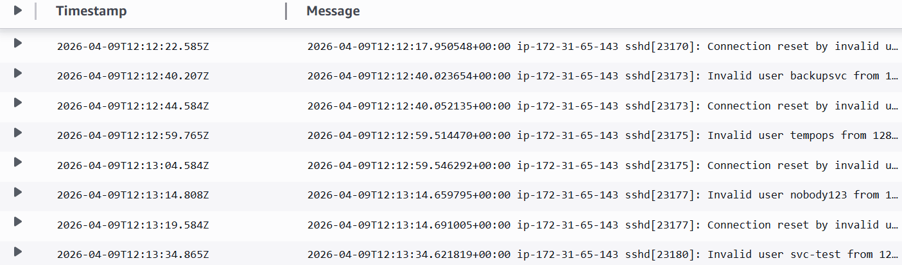
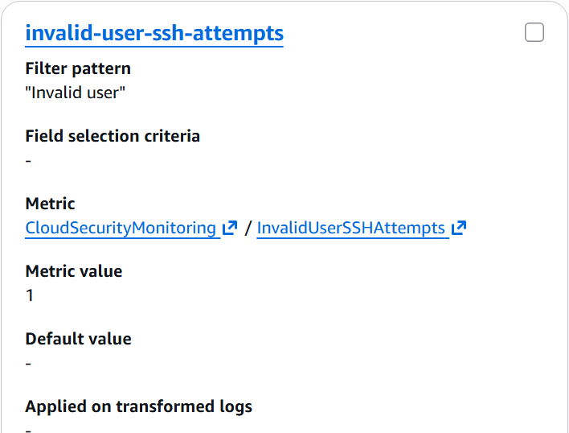
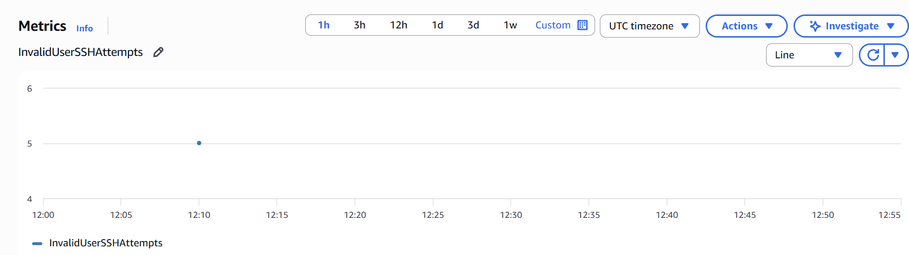
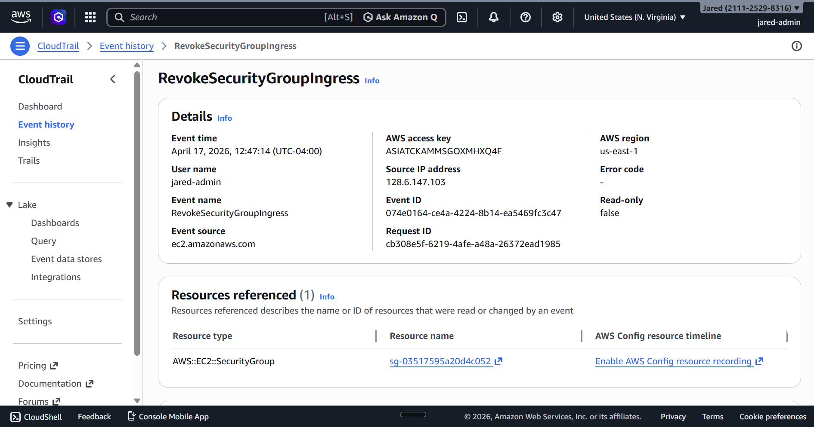
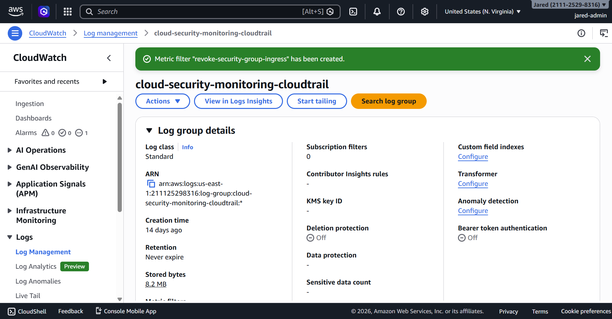
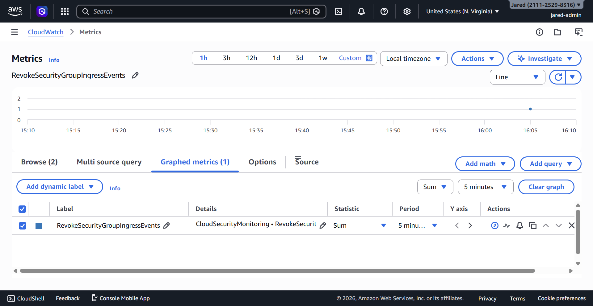

# 05 - Detection Engineering

## Objective

The goal of this phase was to convert raw security telemetry into measurable detection signals that could be monitored and later used for alerting.

For this part of the lab, I focused on two different detection paths:

1. **Host-side detection** for repeated invalid-user SSH login attempts on the EC2 monitoring host
2. **Cloud-side detection** for AWS security group ingress rule removal events recorded in CloudTrail

Together, these detections demonstrate monitoring across both host-level and cloud control-plane telemetry.

## Detection Scope

This phase now includes two detection types:

- **Host-based detection:** repeated `Invalid user` SSH authentication activity
- **CloudTrail-based detection:** `RevokeSecurityGroupIngress` control-plane events

This matters because the lab is designed to show visibility across two different layers:

- Linux host activity on the EC2 instance
- AWS administrative activity in the account itself

---

## Host-Side Detection

### Detection Goal

The host-side detection logic was designed to identify repeated `Invalid user` authentication events generated by the Linux SSH service.

This was a useful first detection because:

- it is easy to reproduce in a controlled way
- it maps to realistic reconnaissance and access-attempt behavior
- it creates a clear host-level signal without requiring a successful compromise
- it can be tracked from raw logs to centralized monitoring to alert generation

### Telemetry Source

The primary telemetry source for this detection was the Linux authentication log on the EC2 instance:

```text
/var/log/auth.log
```

These logs were forwarded from the host into CloudWatch Logs using the CloudWatch Agent.

The relevant CloudWatch log group used for this telemetry was:

```text
cloud-security-monitoring-auth
```

### Log Pattern of Interest

During attack simulation, the EC2 host generated log entries such as:

```text
Invalid user backupsvc from 128.6.147.103
Invalid user tempops from 128.6.147.103
Invalid user nobody123 from 128.6.147.103
Invalid user svc-test from 128.6.147.103
```

These entries became the basis for the host-side detection logic.

### Metric Filter Design

To detect this behavior in CloudWatch Logs, I created a metric filter on the `cloud-security-monitoring-auth` log group.

#### Metric Filter Configuration

- **Filter name:** `invalid-user-ssh-attempts`
- **Filter pattern:** `"Invalid user"`
- **Metric namespace:** `CloudSecurityMonitoring`
- **Metric name:** `InvalidUserSSHAttempts`
- **Metric value:** `1`

This configuration caused every matching `Invalid user` log entry to increment a custom CloudWatch metric by `1`.

### Host-Side Validation

After generating repeated fake SSH login attempts, I validated the host-side detection logic across two layers.

#### 1. CloudWatch Logs Validation

I confirmed that the forwarded authentication logs appeared in the `cloud-security-monitoring-auth` log group and included the expected `Invalid user` entries.

This proved that:

- the host generated the expected telemetry
- the CloudWatch Agent forwarded the logs successfully
- the centralized logging layer contained the correct source events for detection

#### 2. CloudWatch Metric Validation

I then verified that the metric filter converted those log events into the custom metric `InvalidUserSSHAttempts`.

When viewed using the `Sum` statistic, the metric showed a value of `5`, confirming that all five simulated invalid-user SSH attempts were counted during the test window.

This proved that:

- the metric filter matched the intended log entries
- the custom metric was generated correctly
- the detection logic successfully translated raw log text into a measurable signal

### Host-Side Detection Output

The final detection output from this path was the custom CloudWatch metric:

```text
CloudSecurityMonitoring / InvalidUserSSHAttempts
```

This metric became the basis for the host-side alarm configured in the next phase of the lab.

---

## CloudTrail-Side Detection

### Detection Goal

The cloud-side detection logic was designed to identify AWS control-plane events where an ingress rule was removed from a security group.

The first implemented CloudTrail detection focused on the event:

```text
RevokeSecurityGroupIngress
```

This was a strong first cloud-side detection because:

- it is directly tied to AWS network access control
- it represents an administrative change to security posture
- it is easy to simulate safely in a lab
- it demonstrates control-plane visibility beyond host logs

### Telemetry Source

The telemetry source for this detection was AWS CloudTrail.

CloudTrail recorded the event and delivered it into the CloudWatch Logs log group:

```text
cloud-security-monitoring-cloudtrail
```

This made it possible to monitor AWS administrative activity using the same CloudWatch-based detection pipeline used for the host-side signal.

### Event of Interest

To generate the event, I made a controlled inbound security group rule change on the EC2 instance’s attached security group and then removed the temporary rule.

The relevant CloudTrail event identified during validation was:

```text
RevokeSecurityGroupIngress
```

Event source:

```text
ec2.amazonaws.com
```

Security group involved:

```text
sg-03517595a20d4c052
```

### Metric Filter Design

To detect this behavior in CloudWatch Logs, I created a metric filter on the `cloud-security-monitoring-cloudtrail` log group.

#### Metric Filter Configuration

- **Filter name:** `revoke-security-group-ingress`
- **Filter pattern:** `{ ($.eventSource = "ec2.amazonaws.com") && ($.eventName = "RevokeSecurityGroupIngress") }`
- **Metric namespace:** `CloudSecurityMonitoring`
- **Metric name:** `RevokeSecurityGroupIngressEvents`
- **Metric value:** `1`

This configuration caused every matching CloudTrail `RevokeSecurityGroupIngress` event to increment a custom CloudWatch metric by `1`.

### Why This Detection Logic Was Chosen

This was intentionally chosen as the first CloudTrail-side detection because it clearly demonstrates how AWS administrative events can be converted into cloud-native detection signals.

The workflow is straightforward and high-signal:

1. generate a real AWS administrative action
2. confirm the action appears in CloudTrail
3. route the event into CloudWatch Logs
4. match the event with a metric filter
5. convert the event into a custom metric
6. later use that metric for alerting

This made it a strong first control-plane detection to complement the host-based SSH detection.

### CloudTrail-Side Validation

After generating the security group rule removal event, I validated the cloud-side detection logic across two layers.

#### 1. CloudTrail Event Validation

I confirmed in CloudTrail Event history that the security group rule removal generated:

```text
RevokeSecurityGroupIngress
```

This proved that:

- the AWS administrative action was recorded by CloudTrail
- the action came from the correct service source: `ec2.amazonaws.com`
- the target security group was correctly identified in the event data

#### 2. CloudWatch Metric Validation

I then verified that the metric filter converted the CloudTrail event into the custom metric `RevokeSecurityGroupIngressEvents`.

When viewed using the `Sum` statistic, the metric showed a datapoint of `1`, confirming that the `RevokeSecurityGroupIngress` event was successfully counted.

This proved that:

- the metric filter matched the intended CloudTrail event
- the custom metric was generated correctly
- the cloud-side detection logic successfully translated AWS administrative activity into a measurable signal

### CloudTrail-Side Detection Output

The final detection output from this path was the custom CloudWatch metric:

```text
CloudSecurityMonitoring / RevokeSecurityGroupIngressEvents
```

This metric became the basis for the CloudTrail-side alarm configured in the next phase of the lab.

---

## Why These Detection Paths Matter Together

The strongest part of this phase is that it does not rely on just one source of telemetry.

Instead, it demonstrates two detection pipelines:

- one built from Linux host authentication logs
- one built from AWS CloudTrail control-plane events

That combination is important because it shows broader monitoring coverage across both:

- workload-level activity
- cloud administrative activity

This makes the lab stronger than a basic single-source logging project.

## Limitations

These detections still have several limitations:

- both detections rely on relatively simple matching logic
- the host-side rule uses string matching rather than deeper parsing
- the CloudTrail-side rule is focused on a single event type
- neither detection currently correlates with other telemetry sources
- the lab does not yet perform automated response based on these detections
- the cloud-side coverage is still limited to one initial administrative event type

Even with those limitations, this phase provides strong evidence that the lab can turn both host activity and AWS control-plane activity into usable cloud-native security signals.

## Evidence

### Centralized Host Authentication Logs



### Host-Side Metric Filter Configuration



### Host-Side Custom Metric Validation



### CloudTrail Security Group Change Event



### CloudTrail-Side Metric Filter Configuration



### CloudTrail-Side Custom Metric Validation



## Key Takeaway

This phase turned two different forms of raw telemetry into usable cloud-native detection signals.

On the host side, repeated invalid-user SSH activity was collected, matched, and converted into the `InvalidUserSSHAttempts` metric.

On the cloud side, a real AWS security group ingress rule removal event was recorded in CloudTrail, matched in CloudWatch Logs, and converted into the `RevokeSecurityGroupIngressEvents` metric.

Together, these detection paths show that the lab can monitor and translate both host-level and cloud control-plane events into actionable security signals that are ready for alerting.
