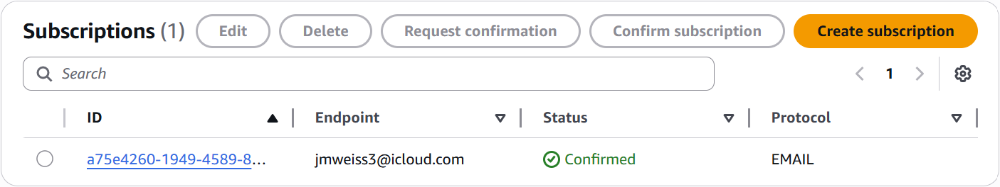

# 06 - Alerting and Response

## Objective

The goal of this phase was to turn the custom host-based detection metric into an actionable alert and validate end-to-end notification delivery.

After building the `InvalidUserSSHAttempts` custom metric in the previous phase, I configured CloudWatch to trigger an alarm when repeated invalid-user SSH attempts exceeded a defined threshold. I then validated that the alarm state change generated an email notification through Amazon SNS.

## Alerting Logic

The alert was based on the custom CloudWatch metric:

```text
CloudSecurityMonitoring / InvalidUserSSHAttempts
```

This metric counted each `Invalid user` SSH authentication event observed in the forwarded Linux authentication logs.

## Alarm Configuration

I created a CloudWatch alarm with the following logic:

- **Alarm name:** `invalid-user-ssh-attempts-alarm`
- **Metric:** `InvalidUserSSHAttempts`
- **Namespace:** `CloudSecurityMonitoring`
- **Threshold:** greater than `3`
- **Evaluation window:** `1` datapoint within `5` minutes
- **Alarm action:** publish notification to SNS topic `cloud-security-monitoring-alerts`

In practice, this meant that if the metric count exceeded three invalid-user SSH attempts during the evaluation period, the alarm would transition into the `ALARM` state.

## SNS Notification Path

To support alert delivery, I configured an Amazon SNS topic for notifications:

```text
cloud-security-monitoring-alerts
```

A confirmed email subscription was attached to this topic so that CloudWatch alarm state changes could be delivered to an email endpoint.

## Validation Process

I validated the alerting path by reusing the host-based detection signal created during attack simulation.

### 1. Alarm Trigger Validation

After generating repeated invalid-user SSH attempts, the `InvalidUserSSHAttempts` metric reached a value of `5`, which exceeded the configured alarm threshold of `3`.

CloudWatch then transitioned the alarm into the `ALARM` state.

This validated that:

- the metric threshold logic was working
- the alarm was tied to the correct custom metric
- the alarm condition was evaluated successfully within the configured time window

### 2. Notification Delivery Validation

Once the alarm entered the `ALARM` state, CloudWatch published the alert to the SNS topic.

I confirmed successful delivery by receiving the email notification containing:

- the alarm name
- the `ALARM` state transition
- the threshold-crossed message
- the timestamp of the event
- the CloudWatch alarm reference link

This proved that the monitoring pipeline extended beyond detection and into actual notification delivery.

## Troubleshooting During Validation

During testing, the original Gmail-based SNS email subscription was repeatedly deactivated immediately after confirmation. This appeared to be an issue with the email endpoint or link-handling path rather than CloudWatch alarming itself.

To isolate the problem and complete end-to-end validation, I moved the SNS subscription to a different email endpoint and repeated the test successfully.

This troubleshooting process was useful because it helped isolate the failure domain correctly:

- **Host telemetry:** working
- **CloudWatch Logs ingestion:** working
- **Metric filter:** working
- **CloudWatch alarm:** working
- **Original email endpoint path:** unstable
- **Alternate email endpoint:** successful

## Operational Meaning of the Alert

This alert indicates that the EC2 monitoring host has received repeated SSH login attempts involving invalid usernames within a short time window.

From an analyst perspective, that behavior could represent:

- basic Internet background scanning
- reconnaissance against an exposed SSH service
- early-stage brute-force or username-enumeration activity

In a real environment, this alert would justify follow-up investigation such as:

- reviewing source IP addresses
- checking whether the activity is isolated or recurring
- comparing with other authentication or network telemetry
- reviewing security group exposure and access controls
- determining whether additional hardening or automated blocking is needed

## Limitations

This alerting workflow has several limitations:

- alerting is email-based only
- there is no automated containment or response action
- the alarm is based on a single host behavior
- the logic does not correlate with CloudTrail or other AWS telemetry yet
- the threshold is simple and may still generate alerts from low-sophistication scanning activity

Even with those limitations, this phase provides strong proof that the lab can move from raw host telemetry to detection, thresholding, and real alert delivery in AWS.

## Evidence

### CloudWatch Alarm Trigger


### SNS Subscription Validation



### SNS Email Alert Delivery


## Key Takeaway

This phase completed the host-side monitoring pipeline by converting the custom `InvalidUserSSHAttempts` metric into a real CloudWatch alarm and validating successful SNS email delivery. It proved that repeated invalid-user SSH activity on the EC2 instance could move all the way from host telemetry to centralized detection to actionable alert notification.
