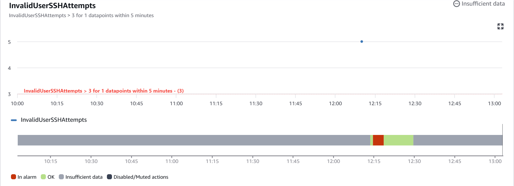
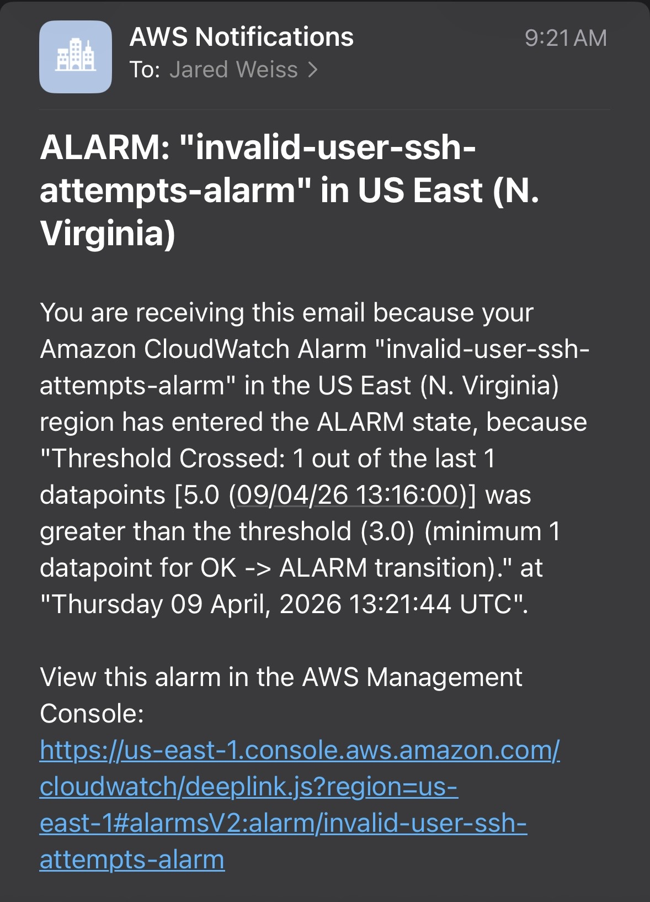
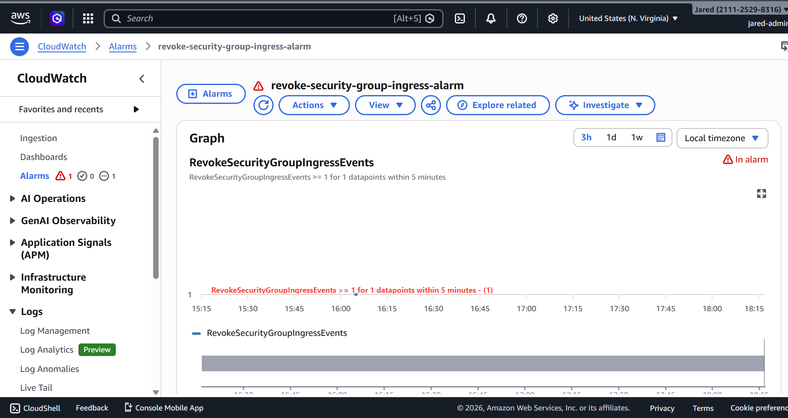
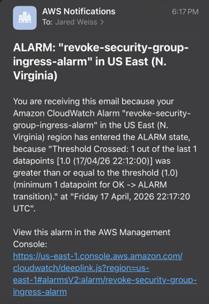
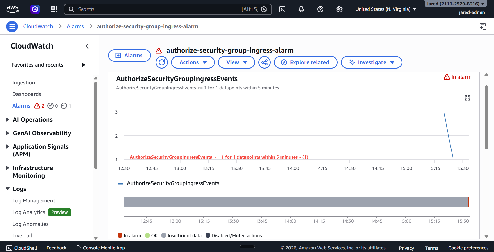
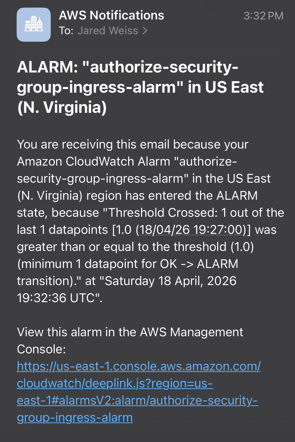
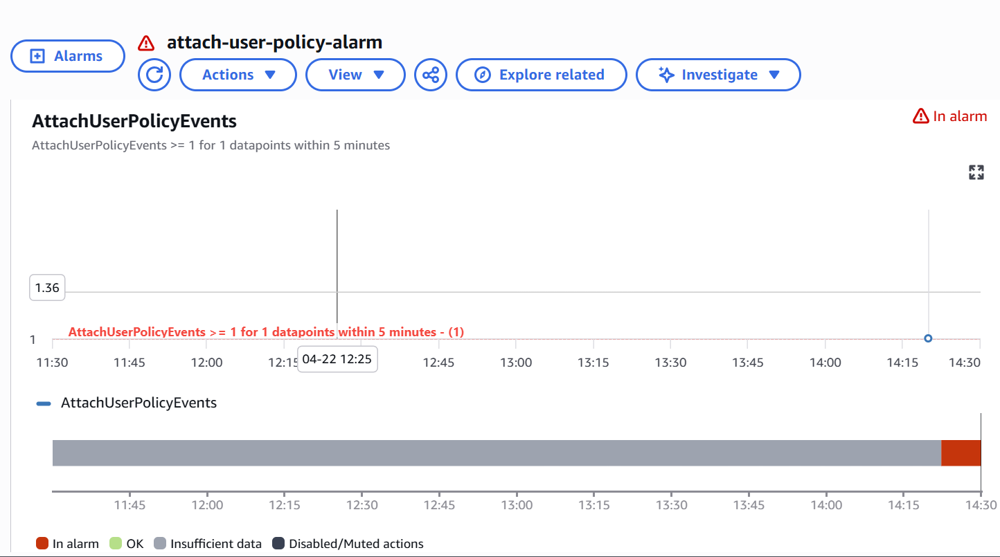
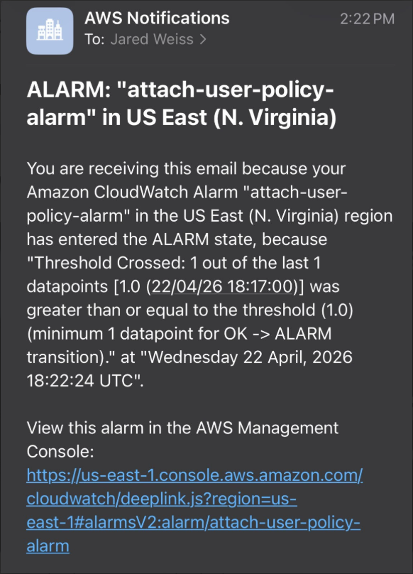

# 06 - Alerting and Response

## Objective

The goal of this phase was to turn the custom detection metrics built earlier in the lab into actionable alerts and validate end-to-end notification delivery.

At this stage, the lab includes four alerting paths:

1. **Host-side alerting** for repeated invalid-user SSH attempts
2. **CloudTrail-side alerting** for security group ingress rule removal events
3. **CloudTrail-side alerting** for security group ingress rule addition events
4. **CloudTrail-side alerting** for IAM managed policy attachment events

Together, these alerting paths show that host activity, AWS network-control-plane activity, and AWS identity-control-plane activity can move from detection to real notification delivery.

---

## Alerting Scope

This phase includes alerting for four different security signals:

- **Host-based signal:** `InvalidUserSSHAttempts`
- **CloudTrail-based signal:** `RevokeSecurityGroupIngressEvents`
- **CloudTrail-based signal:** `AuthorizeSecurityGroupIngressEvents`
- **CloudTrail-based signal:** `AttachUserPolicyEvents`

This matters because the lab is intended to show not just detection, but the ability to turn those detections into meaningful alerts.

---

## Host-Side Alerting: Invalid SSH User Attempts

### Alerting Logic

The host-side alert was based on the custom CloudWatch metric:

```text
CloudSecurityMonitoring / InvalidUserSSHAttempts
```

This metric counted each `Invalid user` SSH authentication event observed in the forwarded Linux authentication logs.

### Alarm Configuration

I created a CloudWatch alarm with the following logic:

- **Alarm name:** `invalid-user-ssh-attempts-alarm`
- **Metric:** `InvalidUserSSHAttempts`
- **Namespace:** `CloudSecurityMonitoring`
- **Threshold:** greater than `3`
- **Evaluation window:** `1` datapoint within `5` minutes
- **Alarm action:** publish notification to SNS topic `cloud-security-monitoring-alerts`

In practice, this meant that if the metric count exceeded three invalid-user SSH attempts during the evaluation period, the alarm would transition into the `ALARM` state.

### Validation

I validated the host-side alerting path by reusing the host-based detection signal created during attack simulation.

#### 1. Alarm Trigger Validation

After generating repeated invalid-user SSH attempts, the `InvalidUserSSHAttempts` metric reached a value of `5`, which exceeded the configured alarm threshold of `3`.

CloudWatch then transitioned the alarm into the `ALARM` state.

This validated that:

- the metric threshold logic was working
- the alarm was tied to the correct custom metric
- the alarm condition was evaluated successfully within the configured time window

#### 2. Notification Delivery Validation

Once the alarm entered the `ALARM` state, CloudWatch published the alert to the SNS topic.

I confirmed successful delivery by receiving the email notification containing:

- the alarm name
- the `ALARM` state transition
- the threshold-crossed message
- the timestamp of the event
- the CloudWatch alarm reference link

This proved that the host-side monitoring pipeline extended beyond detection and into actual notification delivery.

### Operational Meaning

This alert indicates that the EC2 monitoring host received repeated SSH login attempts involving invalid usernames within a short time window.

From an analyst perspective, that behavior could represent:

- basic Internet background scanning
- reconnaissance against an exposed SSH service
- early-stage brute-force or username-enumeration activity

In a real environment, this alert would justify follow-up investigation such as:

- reviewing source IP addresses
- checking whether the activity is isolated or recurring
- comparing with other authentication or network telemetry
- reviewing security group exposure and access controls
- determining whether additional hardening or automated blocking is needed

---

## CloudTrail-Side Alerting: RevokeSecurityGroupIngress

### Alerting Logic

This cloud-side alert was based on the custom CloudWatch metric:

```text
CloudSecurityMonitoring / RevokeSecurityGroupIngressEvents
```

This metric counted CloudTrail events where an ingress rule was removed from a security group.

The underlying event of interest was:

```text
RevokeSecurityGroupIngress
```

### Alarm Configuration

I created a CloudWatch alarm with the following logic:

- **Alarm name:** `revoke-security-group-ingress-alarm`
- **Metric:** `RevokeSecurityGroupIngressEvents`
- **Namespace:** `CloudSecurityMonitoring`
- **Threshold:** greater than or equal to `1`
- **Evaluation window:** `1` datapoint within `5` minutes
- **Alarm action:** publish notification to SNS topic `cloud-security-monitoring-alerts`

In practice, this meant that a single detected `RevokeSecurityGroupIngress` event within the evaluation period was enough to transition the alarm into the `ALARM` state.

### Why the Threshold Is Different

This threshold is intentionally different from the host-side SSH alarm.

For repeated invalid-user SSH attempts, a burst threshold made sense because a single failed attempt is not very meaningful on its own.

For security group ingress rule removal, however, a single event is already significant because it reflects a control-plane change to AWS network access rules.

That makes a threshold of `>= 1` appropriate for this type of alert.

### Validation

I validated the cloud-side alerting path by generating a real AWS administrative action against the EC2 instance’s attached security group.

#### 1. Alarm Trigger Validation

I created and then removed a temporary inbound security group rule to generate a fresh `RevokeSecurityGroupIngress` CloudTrail event.

That event was:

- recorded in CloudTrail
- matched by the CloudWatch Logs metric filter
- converted into the custom metric `RevokeSecurityGroupIngressEvents`

After the new datapoint was registered, CloudWatch transitioned the `revoke-security-group-ingress-alarm` alarm into the `ALARM` state.

This validated that:

- the CloudTrail-side metric threshold logic was working
- the alarm was tied to the correct custom metric
- the alarm condition was evaluated successfully within the configured time window

#### 2. Notification Delivery Validation

Once the alarm entered the `ALARM` state, CloudWatch published the alert to the SNS topic.

I confirmed successful delivery by receiving the email notification containing:

- the alarm name
- the `ALARM` state transition
- the threshold-crossed message
- the timestamp of the event
- the CloudWatch alarm reference link

This proved that the cloud-side monitoring pipeline also extended beyond detection and into real alert delivery.

### Operational Meaning

This alert indicates that an ingress rule was removed from an AWS security group.

From an analyst perspective, that behavior could represent:

- legitimate administrative maintenance
- security hardening or access restriction changes
- unauthorized or risky modification of network controls
- unplanned changes to the exposed attack surface of a resource

In a real environment, this alert would justify follow-up investigation such as:

- confirming who made the change
- reviewing the affected security group and associated resources
- determining whether the change was expected or approved
- checking for related AWS administrative activity before and after the event
- evaluating whether the change affected production access paths or security posture

---

## CloudTrail-Side Alerting: AuthorizeSecurityGroupIngress

### Alerting Logic

This cloud-side alert was based on the custom CloudWatch metric:

```text
CloudSecurityMonitoring / AuthorizeSecurityGroupIngressEvents
```

This metric counted CloudTrail events where an ingress rule was added to a security group.

The underlying event of interest was:

```text
AuthorizeSecurityGroupIngress
```

### Alarm Configuration

I created a CloudWatch alarm with the following logic:

- **Alarm name:** `authorize-security-group-ingress-alarm`
- **Metric:** `AuthorizeSecurityGroupIngressEvents`
- **Namespace:** `CloudSecurityMonitoring`
- **Threshold:** greater than or equal to `1`
- **Evaluation window:** `1` datapoint within `5` minutes
- **Alarm action:** publish notification to SNS topic `cloud-security-monitoring-alerts`

In practice, this meant that a single detected `AuthorizeSecurityGroupIngress` event within the evaluation period was enough to transition the alarm into the `ALARM` state.

### Why This Alert Matters

This alert complements the revoke alert by providing visibility into when security group exposure is opened, not just when it is removed.

That matters because an ingress rule addition may represent:

- legitimate administrative work
- intentional exposure of a service
- accidental overexposure
- risky or unauthorized network-access changes

Together, the authorize and revoke alerts provide more complete monitoring coverage of security group change activity.

### Validation

I validated the authorize alerting path by generating a real AWS administrative action against the EC2 instance’s attached security group.

#### 1. Alarm Trigger Validation

I added a temporary inbound security group rule to generate a fresh `AuthorizeSecurityGroupIngress` CloudTrail event.

That event was:

- recorded in CloudTrail
- matched by the CloudWatch Logs metric filter
- converted into the custom metric `AuthorizeSecurityGroupIngressEvents`

After the new datapoint was registered, CloudWatch transitioned the `authorize-security-group-ingress-alarm` alarm into the `ALARM` state.

This validated that:

- the CloudTrail-side metric threshold logic was working
- the alarm was tied to the correct custom metric
- the alarm condition was evaluated successfully within the configured time window

#### 2. Notification Delivery Validation

Once the alarm entered the `ALARM` state, CloudWatch published the alert to the SNS topic.

I confirmed successful delivery by receiving the email notification containing:

- the alarm name
- the `ALARM` state transition
- the threshold-crossed message
- the timestamp of the event
- the CloudWatch alarm reference link

This proved that the authorize detection path also extended beyond detection and into real alert delivery.

### Operational Meaning

This alert indicates that an ingress rule was added to an AWS security group.

From an analyst perspective, that behavior could represent:

- legitimate administrative maintenance
- intentional service exposure
- accidental misconfiguration
- risky or unauthorized expansion of network exposure

In a real environment, this alert would justify follow-up investigation such as:

- confirming who made the change
- reviewing the port, protocol, and source range that were added
- determining whether the change was expected or approved
- checking what resource the security group is attached to
- evaluating whether the new rule introduced unnecessary exposure

---

## CloudTrail-Side Alerting: AttachUserPolicy

### Alerting Logic

This IAM-focused cloud-side alert was based on the custom CloudWatch metric:

```text
CloudSecurityMonitoring / AttachUserPolicyEvents
```

This metric counted CloudTrail events where a managed IAM policy was attached directly to a user.

The underlying event of interest was:

```text
AttachUserPolicy
```

### Alarm Configuration

I created a CloudWatch alarm with the following logic:

- **Alarm name:** `attach-user-policy-alarm`
- **Metric:** `AttachUserPolicyEvents`
- **Namespace:** `CloudSecurityMonitoring`
- **Threshold:** greater than or equal to `1`
- **Evaluation window:** `1` datapoint within `5` minutes
- **Alarm action:** publish notification to SNS topic `cloud-security-monitoring-alerts`

In practice, this meant that a single detected `AttachUserPolicy` event within the evaluation period was enough to transition the alarm into the `ALARM` state.

### Why This Alert Matters

This alert adds identity-control-plane coverage to the lab.

A managed policy attachment can be legitimate administrative activity, but it can also indicate privilege expansion if performed unexpectedly. In a real AWS environment, attaching a powerful policy to a user could expand access quickly and materially change account risk.

This alert is useful because it provides visibility into IAM permission changes that could indicate:

- unauthorized access expansion
- privilege escalation
- risky administrative activity
- post-compromise permission changes
- direct attachment of sensitive managed policies

Even though the lab used `IAMReadOnlyAccess` for safe validation, the same alerting logic would also catch higher-impact policy attachments.

### Validation

I validated the IAM alerting path by attaching the AWS managed `IAMReadOnlyAccess` policy to a test IAM user.

The test user was:

```text
attach-policy-test-user
```

#### 1. Alarm Trigger Validation

The policy attachment generated a CloudTrail `AttachUserPolicy` event.

That event was:

- recorded in CloudTrail
- matched by the CloudWatch Logs metric filter
- converted into the custom metric `AttachUserPolicyEvents`

After the new datapoint was registered, CloudWatch transitioned the `attach-user-policy-alarm` alarm into the `ALARM` state.

This validated that:

- the IAM metric threshold logic was working
- the alarm was tied to the correct custom metric
- the alarm condition was evaluated successfully within the configured time window

#### 2. Notification Delivery Validation

Once the alarm entered the `ALARM` state, CloudWatch published the alert to the SNS topic.

I confirmed successful delivery by receiving the email notification containing:

- the alarm name
- the `ALARM` state transition
- the threshold-crossed message
- the timestamp of the event
- the CloudWatch alarm reference link

This proved that the IAM detection path extended beyond detection and into real alert delivery.

### Operational Meaning

This alert indicates that a managed IAM policy was attached directly to a user.

From an analyst perspective, that behavior could represent:

- legitimate IAM administration
- unauthorized permission expansion
- privilege escalation
- attacker access expansion after credential compromise
- persistence or preparation for broader AWS access

In a real environment, this alert would justify follow-up investigation such as:

- confirming who attached the policy
- reviewing which user received the policy
- reviewing which policy was attached
- determining whether the change was expected or approved
- checking for other IAM activity before and after the event
- reviewing whether the actor had unusual source IP, session, or access-key characteristics

---

## SNS Notification Path

To support alert delivery, I configured an Amazon SNS topic for notifications:

```text
cloud-security-monitoring-alerts
```

A confirmed email subscription was attached to this topic so that CloudWatch alarm state changes could be delivered to an email endpoint.

This SNS topic was used for:

- the host-side invalid-user SSH alarm
- the CloudTrail-side security group ingress removal alarm
- the CloudTrail-side security group ingress addition alarm
- the CloudTrail-side IAM managed policy attachment alarm

---

## Troubleshooting During Validation

One of the most useful parts of this phase was the troubleshooting process around notification delivery.

During the earlier host-side validation, the original Gmail-based SNS email subscription repeatedly became deactivated shortly after confirmation. This appeared to be an issue with the email endpoint or link-handling path rather than CloudWatch alarming itself.

To isolate the problem and complete end-to-end validation, I moved the SNS subscription to a different email endpoint and repeated the test successfully.

This troubleshooting process helped isolate the failure domain correctly:

- **Host telemetry:** working
- **CloudWatch Logs ingestion:** working
- **Metric filter:** working
- **CloudWatch alarm:** working
- **Original email endpoint path:** unstable
- **Alternate email endpoint:** successful

That troubleshooting mattered because it reinforced that alert delivery paths need to be validated just as carefully as the detection logic itself.

---

## Limitations

This alerting workflow still has several limitations:

- alerting is email-based only
- there is no automated containment or remediation action
- the host-side alarm is based on one SSH-related behavior
- the cloud-side alarms are based on a small set of specific CloudTrail event types
- the workflow does not yet correlate host-side and cloud-side events together
- thresholds and alerting logic are intentionally simple for the initial lab implementation
- IAM alerting is limited to one event type in this version of the lab

Even with those limitations, this phase provides strong proof that the lab can move from raw telemetry to detection, thresholding, and real alert delivery for host-level activity, network-control-plane activity, and identity-control-plane activity.

---

## Evidence

### Host-Side CloudWatch Alarm Trigger



### Host-Side SNS Email Alert Delivery



### CloudTrail Revoke CloudWatch Alarm Trigger



### CloudTrail Revoke SNS Email Alert Delivery



### CloudTrail Authorize CloudWatch Alarm Trigger



### CloudTrail Authorize SNS Email Alert Delivery



### IAM AttachUserPolicy CloudWatch Alarm Trigger



### IAM AttachUserPolicy SNS Email Alert Delivery



---

## Key Takeaway

This phase completed four end-to-end alerting paths in the lab.

On the host side, repeated invalid-user SSH attempts were converted into the `InvalidUserSSHAttempts` metric, evaluated by a CloudWatch alarm, and delivered through SNS.

On the cloud network-control-plane side, AWS security group ingress rule removal and addition events were converted into the `RevokeSecurityGroupIngressEvents` and `AuthorizeSecurityGroupIngressEvents` metrics, evaluated by CloudWatch alarms, and delivered through SNS.

On the cloud identity-control-plane side, IAM managed policy attachment events were converted into the `AttachUserPolicyEvents` metric, evaluated by a CloudWatch alarm, and delivered through SNS.

Together, these alerting paths show that the lab can move from host telemetry and AWS administrative activity to centralized detection, alarm state changes, and actionable notification delivery.
