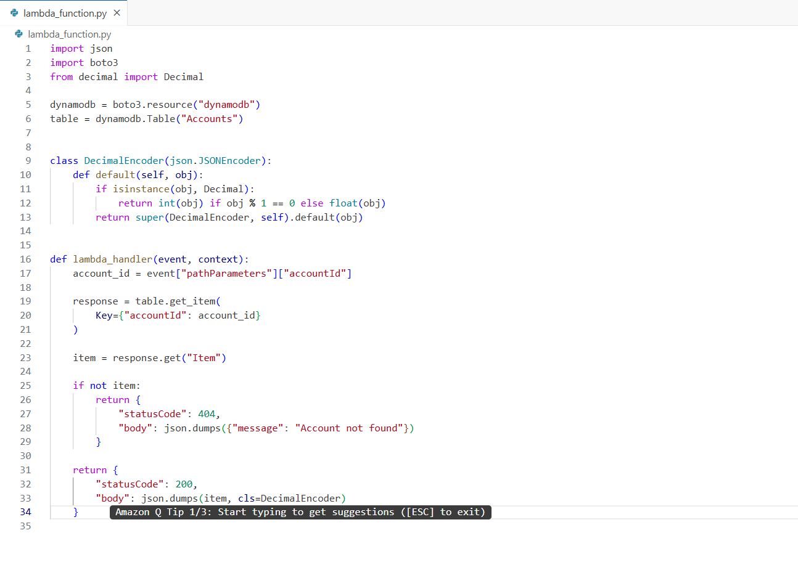

## Evidence

### Permission Error

Initial execution failed due to missing DynamoDB permissions.

---

### Lambda Code

The following implementation retrieves account data based solely on the provided accountId.

---

### Test Result - Account 123

This confirms normal functionality for a valid account.

---

### Test Result - Account 456

This shows the function also returns data for a different account when requested directly.

