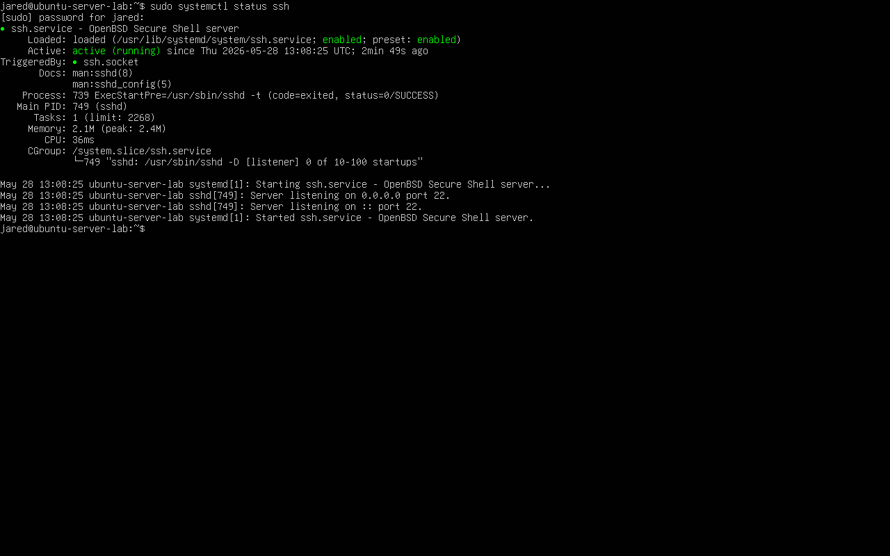
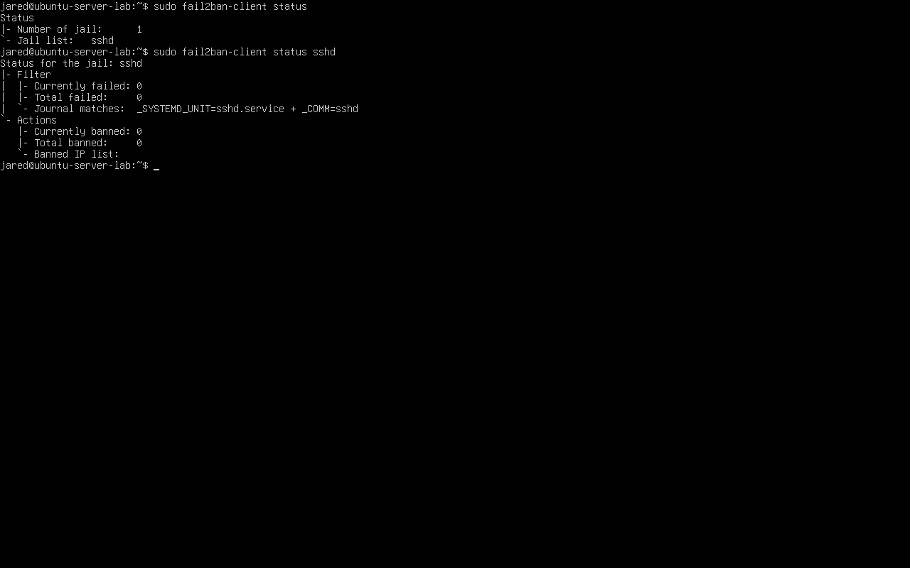
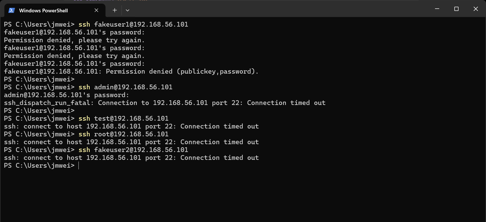
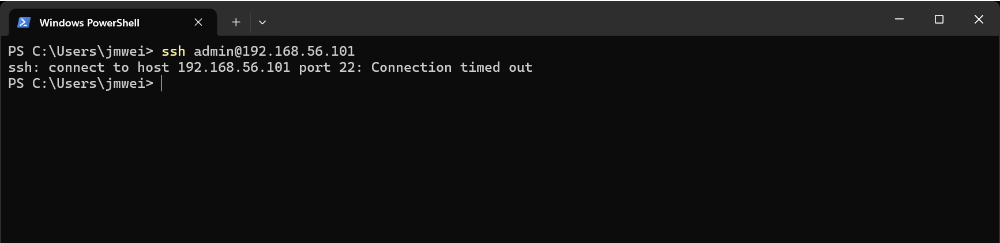

# Simulation Architecture

## Overview

This document describes the architecture for a local SSH detection engineering simulation built with VirtualBox, Ubuntu Server, OpenSSH, Fail2Ban, Linux authentication logs, and custom detection logic.

The simulation recreates a simplified SOC workflow:

~~~text
Controlled SSH Activity
        ↓
Linux Authentication Telemetry
        ↓
Manual Log Review
        ↓
Detection Logic
        ↓
Automated Mitigation
        ↓
Detection-as-Code Correlation
~~~

The goal is not to expose a real server to the internet. The goal is to safely generate realistic SSH authentication events and use those events to build, validate, and document detection logic.

---

## Architecture Diagram

~~~text
Windows 11 Host
(Admin Workstation + Attack Simulation Source)
        |
        | SSH attempts over host-only network
        |
        v
Ubuntu Server 24.04 VM
(OpenSSH Server)
        |
        | Writes authentication events
        |
        v
/var/log/auth.log
(Linux Authentication Telemetry)
        |
        | Reviewed with grep, awk, tail, and manual triage
        |
        v
Detection Workflow
        |
        |------------------------------|
        |                              |
        v                              v
Fail2Ban                         Custom Detection Logic
(sshd jail)                      (Shell + Python)
        |                              |
        |                              v
        |                       Alert Output
        |                       - repeated failures
        |                       - invalid users
        |                       - failures followed by success
        |
        v
Firewall Ban
(Automated IP Blocking)
~~~

---

## Host Environment

| Component | Details |
|---|---|
| Host OS | Windows 11 |
| Virtualization Platform | Oracle VirtualBox |
| Host Role | Administrative workstation and controlled SSH activity source |
| Source IP | `192.168.56.1` |

The Windows host performs two roles:

1. Administrative control point for managing the Ubuntu VM
2. Controlled SSH activity source for generating authentication telemetry

This design keeps all testing local and controlled while still producing real SSH logs on the Ubuntu server.

---

## Guest Environment

| Component | Details |
|---|---|
| Guest OS | Ubuntu Server 24.04 LTS |
| Hostname | `ubuntu-server-lab` |
| Guest IP | `192.168.56.101` |
| Primary Service | OpenSSH Server |
| Log Source | `/var/log/auth.log` |
| Defensive Tool | Fail2Ban |
| Detection Logic | Shell commands and Python scripts |

The Ubuntu VM functions as the monitored Linux server. It receives SSH authentication attempts, writes authentication events to `/var/log/auth.log`, and runs defensive controls against repeated failed logins.

Evidence:

---

## Network Architecture

| Setting | Value |
|---|---|
| Network Mode | Host-only networking |
| Source IP | `192.168.56.1` |
| Target IP | `192.168.56.101` |
| Exposed Service | SSH on TCP/22 |
| External Exposure | None |

The simulation uses host-only networking so the Ubuntu VM is reachable from the Windows host but not exposed to the public internet.

This allows SSH activity simulation without creating unnecessary real-world exposure.

---

## Exposed Services

Only SSH was intentionally exposed inside the local network.

| Service | Port | Purpose |
|---|---|---|
| SSH | TCP/22 | Generate authentication telemetry and test detection logic |

The simulation does not expose web services, databases, cloud resources, or external-facing applications.

This narrow attack surface keeps the project focused on SSH authentication monitoring and response.

Evidence:

---

## Security Controls

Fail2Ban is deployed on the Ubuntu server to monitor SSH authentication activity and automatically ban source IPs that exceed failure thresholds.

| Control | Purpose |
|---|---|
| OpenSSH Server | Generates authentication events |
| `/var/log/auth.log` | Stores Linux authentication telemetry |
| Fail2Ban `sshd` jail | Detects repeated failed SSH attempts |
| Firewall ban | Blocks offending source IPs |
| Shell commands | Support manual investigation and aggregation |
| Python detection scripts | Correlate authentication behavior over time |

Evidence:

---

## Telemetry Flow

SSH activity in this simulation follows this telemetry path:

~~~text
SSH login attempt
        ↓
OpenSSH processes authentication
        ↓
Authentication result is written to /var/log/auth.log
        ↓
Analyst reviews logs manually
        ↓
Detection logic identifies suspicious patterns
        ↓
Fail2Ban or Python logic produces response/alert output
~~~

The primary telemetry source is:

~~~text
/var/log/auth.log
~~~

This file records SSH events such as:

- invalid username attempts
- failed password attempts
- accepted password logins
- source IP addresses
- target usernames
- SSH process identifiers
- timestamps

---

## Detection Pipeline

The simulation uses multiple layers of detection:

| Layer | Purpose |
|---|---|
| Raw log review | Confirm authentication events exist |
| Pattern identification | Identify repeated failed attempts and invalid usernames |
| Fail2Ban response | Automatically ban IPs exceeding thresholds |
| Shell aggregation | Count failures by source IP |
| Python time-window detection | Alert on repeated failures within a short window |
| Failed-to-successful correlation | Detect failed attempts followed by successful login from the same IP |

This progression shows how detection engineering develops from raw telemetry into repeatable detection logic.

---

## Trust Boundaries

The architecture has two main trust zones:

~~~text
Trusted Administrative Zone
- Windows 11 host
- Used for VM management and controlled SSH testing

Monitored Server Zone
- Ubuntu Server VM
- Receives SSH attempts
- Generates logs
- Runs detection and response tooling
~~~

All SSH activity is intentionally generated from the Windows host. Because the simulation is isolated, suspicious authentication activity in the logs is known to come from controlled testing.

This isolation makes it easier to validate detection logic without background internet noise.

---

## Threat Model

This simulation models common SSH authentication threats against Linux systems.

The simulated behaviors include:

- repeated failed SSH login attempts
- invalid username probing
- brute-force-style password guessing
- burst authentication attempts
- failed attempts followed by successful login from the same source IP

The final pattern is especially important because it may indicate that an attacker moved from unsuccessful authentication attempts to successful access.

---

## Attack Simulation Source

All SSH activity was generated from the Windows host using PowerShell and the native SSH client.

Example simulated activity:

~~~powershell
ssh fakeuser1@192.168.56.101
ssh admin@192.168.56.101
ssh test@192.168.56.101
ssh root@192.168.56.101
~~~

Evidence:

---

## Defensive Response Path

Fail2Ban monitors SSH authentication failures and applies automated blocking when the configured threshold is reached.

The response path is:

~~~text
Repeated failed SSH logins
        ↓
Events written to /var/log/auth.log
        ↓
Fail2Ban sshd jail detects threshold match
        ↓
Source IP is added to banned list
        ↓
Further SSH connections from that IP are blocked
~~~

Evidence:

---

## Design Decisions

| Decision | Reason |
|---|---|
| Use VirtualBox | Keeps the environment local, free, and repeatable |
| Use Ubuntu Server | Provides realistic Linux authentication logging |
| Use host-only networking | Prevents public exposure while allowing SSH testing |
| Use OpenSSH | Produces real SSH authentication telemetry |
| Use Fail2Ban | Demonstrates automated defensive response |
| Use `/var/log/auth.log` | Provides raw Linux security telemetry |
| Use Python detection logic | Demonstrates detection-as-code and correlation |
| Use screenshots | Provides evidence that the simulation was built and validated |

---

## Deployment Considerations

During initial setup, outbound internet connectivity was required for:

- Ubuntu package updates
- OpenSSH installation
- Fail2Ban installation
- dependency installation

After setup, the simulation was operated in a controlled host-only environment to prevent public exposure.

This separation supports safe testing while still allowing realistic SSH telemetry generation.

---

## Limitations

This architecture is intentionally simple.

Current limitations include:

- single attacker/source IP
- single Ubuntu target host
- no centralized SIEM ingestion
- no multi-host log forwarding
- no external threat intelligence enrichment
- no cloud-based detection pipeline
- no post-login command monitoring

These limitations are acceptable because the focus is host-based SSH detection engineering.

---

## Key Design Lessons

- Detection starts with reliable telemetry.
- SSH authentication logs provide enough detail to build meaningful detections.
- Automated blocking is useful, but it must be validated from both the defender and attacker perspective.
- Failed login attempts alone are useful, but failed attempts followed by successful login are higher value.
- A controlled local simulation can still demonstrate realistic SOC skills when evidence, logs, detection logic, and response validation are documented clearly.

---

## Summary

This architecture supports an end-to-end SSH detection workflow:

~~~text
Simulate attack behavior
        ↓
Generate authentication logs
        ↓
Investigate suspicious activity
        ↓
Aggregate failed login patterns
        ↓
Trigger automated response
        ↓
Build detection-as-code logic
        ↓
Correlate failed attempts with successful access
~~~

The result is a safe, isolated, recruiter-readable detection engineering simulation focused on Linux authentication telemetry and SSH threat detection.
